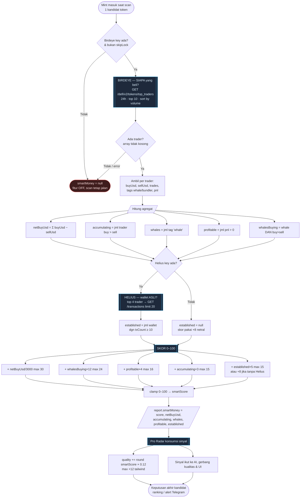
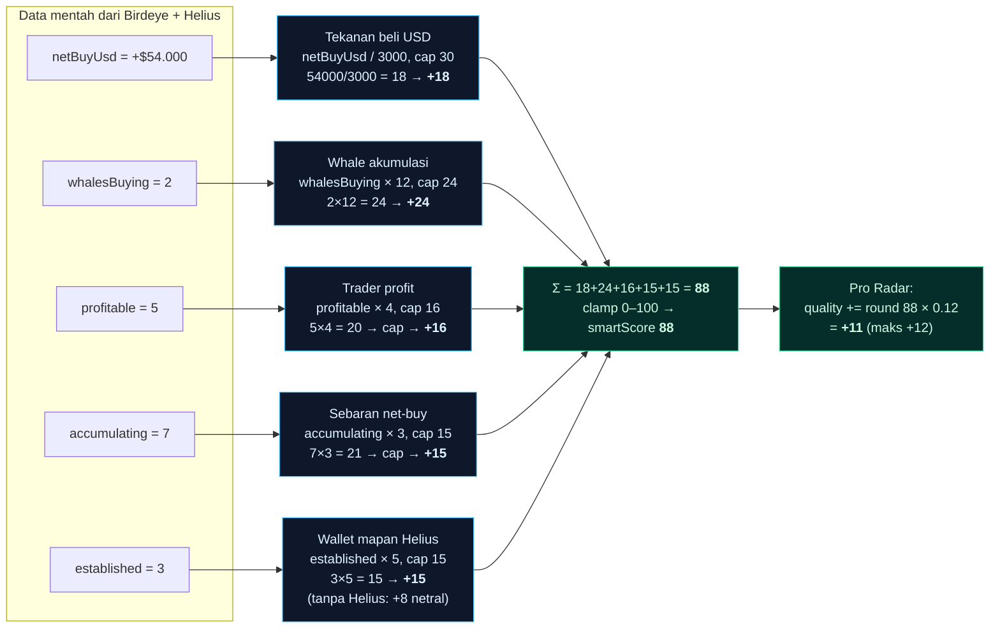
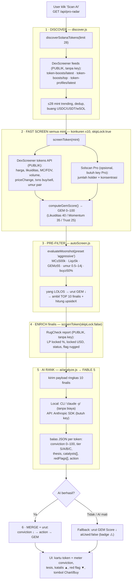
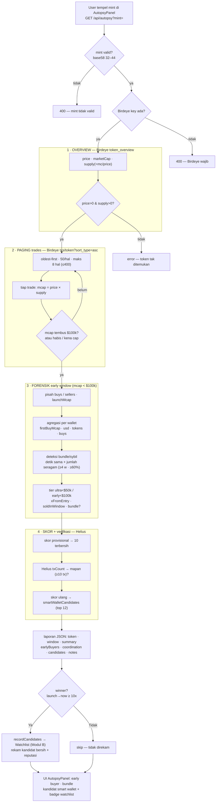
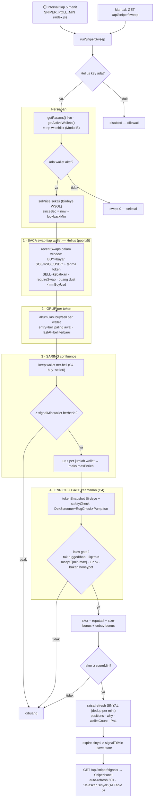

# Laporan: Memecoin-Screener — Apa Saja yang Sudah Dibangun

> Laporan ini menjelaskan seluruh sistem yang sudah dibangun di repo ini beserta
> flowchart alurnya, supaya gampang dibaca dan dipahami arah arsitekturnya.
> Untuk state teknis, cara menjalankan, dan roadmap, lihat [HANDOVER.md](HANDOVER.md).

---

## 1. Ringkasan

Repo ini berkembang dari "MCP server Solscan + UI explorer sederhana" menjadi
**platform screening memecoin Solana** yang lengkap. Ada 6 sistem besar:

| # | Sistem | Status | Fungsi inti |
|---|--------|--------|-------------|
| 1 | **GEM Score™ Screener** | ✅ Jalan | Skor 0–100 kualitas/risiko token dari data live |
| 2 | **10x Radar (Auto-Screener)** | ✅ Jalan | Otomatis cari token "potensi 10x" tiap interval |
| 3 | **🧠 Pro Radar (Fable 5)** | ✅ Jalan | 10x Radar + gerbang kualitas + peringkat AI + **self-tuning** (belajar dari hasil) |
| 4 | **AI Analyst Chat** | ✅ Jalan | Chat AI (Claude) yang bisa panggil tool on-chain |
| 5 | **Telegram Alert + Trojan link** | ✅ Jalan | Push notif token bagus + link beli 1-tap |
| 6 | **MCP Servers (Rust + Node)** | ✅ Jalan | Sambungkan screener ke Claude Desktop |

Plus: **Kalkulator Screening Manual + Checklist** (hitung skor risiko dari angka
yang kamu baca sendiri di DexScreener/RugCheck), **Settings panel** (kelola API key
dari UI, key tetap di server), dan **proxy Express** sebagai jembatan aman
browser ↔ API yang sekaligus **menyajikan frontend build** (mode satu port :8787).

---

## 🆕 Pembaruan terbaru (ringkas, biar gampang dibaca)

### 🎯 SNIPER ENGINE — sistem baru (paling besar!)

Sekarang web/app ini bisa jadi **sniper crypto** sungguhan: menemukan token yang
sedang **diakumulasi smart money SEBELUM naik**. Kerjanya sebagai satu loop yang
**belajar sendiri**, dibagi 3 panel baru (urutannya di halaman: Bedah → Watchlist → Sinyal):

| Panel | Apa gunanya buat kamu |
|-------|-----------------------|
| 🔬 **Bedah Coin** | Tempel alamat token yang **sudah naik** → dibongkar **siapa yang beli lebih awal** (saat market cap masih kecil), siapa yang **hold vs jual**, mana yang **bundle/bot**, dan **kandidat smart wallet** untuk dibuntuti. Jawab pertanyaan "kok bisa naik ribuan persen — siapa di baliknya?" |
| 🎯 **Watchlist Smart Wallet** | Wallet yang **berulang kali menangkap winner lebih awal** direkam **otomatis** dari Bedah Coin (hanya kalau tokennya benar-benar winner ≥10x), lalu diperingkat sesuai rekam jejak. Makin sering kamu bedah winner, makin pintar daftarnya. |
| 🎯 **Sinyal Sniper Live** | Server memantau 40 wallet terbaik tiap 5 menit. Begitu **beberapa dari mereka borong token kecil yang sama** → muncul sinyal "smart money lagi akumulasi" — kesempatan masuk **sebelum** pump. Auto-refresh + tombol sweep manual. |

> Datanya dari **Birdeye** (riwayat trade dari awal) + **Helius** (verifikasi wallet).
> Semua setelan bisa diubah lewat env (`SNIPER_SIGNAL_MIN`, `SNIPER_WATCH_SIZE`, dll).
> Kualitas sinyal makin tajam seiring Watchlist diisi lebih banyak winner beragam.
> Detail lengkap + keputusan desain ada di **[SNIPER-ENGINE.md](SNIPER-ENGINE.md)**.

### 🆕 Pembaruan 7 Juli 2026 (Sniper v2 · Fable 5 · flowchart · mode AI)

| Perubahan | Ringkas |
|-----------|---------|
| 🎯 **Sniper Live v2** | Registry parameter yang bisa **diubah live dari Settings** (berlaku sweep berikutnya, tanpa restart), mesin **net-buy** (wallet beli-lalu-jual tidak dihitung akumulasi), dan **dua aliran** sinyal paralel (**Awal/v1** & **v2**). Rekap parameter Awal vs v2 di **[REKAP-PARAMETER.md](REKAP-PARAMETER.md)**. |
| 🧠 **Semua model → Fable 5** | Dropdown model di Settings dikunci ke `claude-fable-5` (opsi lain dihapus); default widget chat & `.env.example` ikut Fable 5; chat lokal, Pro Radar, dan "Jelaskan sinyal" meneruskan `--model claude-fable-5`. |
| 🔧 **Mode AI lokal andal** | CLI `claude` yang di-spawn tidak lagi mewarisi `ANTHROPIC_API_KEY` dari `.env`, sehingga mode Local **selalu pakai login langganan** (gratis) dan tak lagi gagal *"Invalid API key"* / *"credit balance too low"* saat key API kosong/low-balance. "Jelaskan sinyal" juga tidak lagi memaksa jalur API saat mode Local. |
| 🔀 **Flowchart alur** | Diagram Mermaid + ASCII untuk **Bedah Coin (§7)** dan **Sniper Live (§8)** ditambahkan (juga di SNIPER-ENGINE.md). |

### 🆕 Pembaruan 8–10 Juli 2026 (hold/exit · floor mcap · real-time · Robinhood Chain · tema)

| Perubahan | Ringkas |
|-----------|---------|
| 🧹 **Sinyal auto-hilang saat smart money keluar** | Tiap sweep cek saldo on-chain wallet di balik sinyal → **buang sinyal begitu semua sudah jual**. Cek filter `{mint}` + **fallback RPC publik** saat Helius RPC 429; TTL jadi *backstop*. |
| 💲 **Batas minimal market cap $20.000** | Ditegakkan di Sinyal Sniper Live (kedua aliran) — token di bawah $20rb dibuang. |
| ⚡ **Real-time via Helius Webhook** | Ganti polling 5-menit → **push**: wallet watchlist swap → Helius kirim notifikasi → app langsung sweep. URL publik auto-deteksi (ngrok/`PUBLIC_URL`); polling tetap fallback. |
| ⛓️ **Ekosistem Robinhood Chain (EVM)** | Pipeline kembar EVM (discover + Bedah + Watchlist + Sniper + auto-loop, tanpa key). Toggle **Solana ⇄ Robinhood Chain**. Detail: [ROBINHOOD-CHAIN.md](ROBINHOOD-CHAIN.md). |
| 🎨 **Tema Robinhood + rapikan zona Solana** | Kanvas hitam + aksen hijau `#00C805`; **GEM Score** & **10x Radar** disembunyikan dari tampilan Solana; sinyal **unverified** disembunyikan; kotak "Jelaskan" **melebar otomatis**. |

### Pembaruan Pro Radar

Fitur-fitur terbaru di **Pro Radar** (urut dari yang terbaru). Detail teknis
ada di [bagian 2.3](#23--pro-radar--10x-radar-bertenaga-ai-fable-5).

| Fitur | Apa gunanya buat kamu |
|-------|-----------------------|
| 🧠 **Smart money tracking** | Menandai token yang sedang **diakumulasi trader top / whale** yang profitnya bagus. Datanya dari **Birdeye** (siapa yang beli) + **Helius** (wallet-nya asli/mapan, bukan bot). Muncul sebagai badge **🧠 Smart N · 🐋** di kartu token. Perlu API key (Birdeye wajib, Helius opsional) — diisi di Settings. |
| 🎯 **Self-tuning target win rate 90%** | Sistem mencatat tiap pick, menilai hasilnya beberapa jam kemudian (naik/turun/rug), lalu **memperketat filter sendiri** kalau win rate turun. Ada **pengaman** biar radar tak pernah kosong permanen. ⚠️ 90% itu *target yang dikejar*, bukan jaminan — efeknya token yang tampil lebih sedikit tapi lebih aman. |
| 🛡️ **Gerbang kualitas + buang AVOID** | Token rug, likuiditas tipis, honeypot, sudah dump jauh dari ATH, atau di-ban Pump.fun **dibuang otomatis**. Yang tampil hanya yang lolos + di-ranking AI. |
| 🎓 **Sinyal Pump.fun** | Badge **🎓 grad** untuk token yang sudah lulus bonding curve (lebih matang), dan deteksi token yang sudah pump-and-dump. |
| 📊 **Chart DexScreener inline** | Klik token → chart harga langsung muncul. Di **HP chart melayang** (overlay), logo token di header, tanpa tulisan atribusi. |

> **Ingat selalu:** semua ini **alat bantu heuristik, bukan nasihat keuangan atau
> jaminan cuan.** Memecoin sangat berisiko — DYOR, pakai uang yang siap hilang.

---

## 2. Komponen yang sudah dibangun (detail)

### 2.1 GEM Score™ — Mesin penilaian token
**File:** `web/server/screener/gemScore.js`, `screen.js`, `sources.js`

Skor 0–100 dihitung dari **3 pilar** berbobot:

| Pilar | Bobot | Yang dinilai |
|-------|-------|--------------|
| 🏦 Liquidity & Market | 40 | Kedalaman likuiditas, volume 24j, turnover (vol/likuiditas), LP lock |
| 📈 Momentum | 35 | Tren harga 1h/6h, rasio buy/sell, jumlah transaksi 24j |
| 🛡️ Trust & Age | 25 | Umur pair, jumlah pool/DEX, distribusi holder |

**Verdict:** 🟢 STRONG (≥70) · 🟡 WATCH (≥50) · 🔴 SKIP (<50)

Sumber data (semua **degrade gracefully** kalau gagal):
- **DexScreener** (gratis, tanpa key) → tulang punggung, selalu jalan.
- **Solscan Pro** (opsional, perlu key) → enrich data holder.
- **RugCheck** (gratis) → cek LP locked % (sinyal anti-rug terpenting).

Skor ini **heuristik, bukan prediksi dan bukan saran finansial** — selalu DYOR.

### 2.2 10x Radar — Pemburu otomatis
**File:** `web/server/screener/autoScreen.js`, `discover.js`

Alur: **Discover → Screen → Filter → Alert**
- Ambil token trending dari feed publik DexScreener (token-boosts + token-profiles).
- Screen semua paralel (default 18 token, konkurensi 9, `skipLock` agar cepat ~8 detik).
- Saring pakai preset kriteria:

| Preset | Max Market Cap | Min Likuiditas | Min GEM | Umur | Min LP Lock |
|--------|----------------|----------------|---------|------|-------------|
| aggressive | $500K | $5K | 55 | 0.5j–14h | 0% |
| balanced (default) | $2M | $10K | 60 | 1j–30h | 30% |
| conservative | $5M | $50K | 72 | 6j–60h | 80% |

- Hitung estimasi upside sebagai kelipatan ke $10M (mis. "~14x").
- Token baru yang lolos → push ke Telegram (dedup via `alertedMints`, maks 5/scan).
- Auto-jalan tiap `RADAR_INTERVAL_MIN` menit (default 15); set `=0` untuk mematikan,
  atau panggil `GET /api/auto-screen` dari scheduler eksternal bila ingin on-demand.

### 2.3 🧠 Pro Radar — 10x Radar bertenaga AI (Fable 5)
**File:** `web/server/screener/proRadar.js`, `web/server/ai/analyze.js`,
komponen frontend `web/frontend/src/components/panels/ProRadarPanel.vue`
**Endpoint:** `GET /api/pro-radar` · **Dokumen alur lengkap:** [PRO-RADAR.md](PRO-RADAR.md)

Funnel penemuannya sama seperti 10x Radar, tapi finalisnya di-*enrich* dengan data
liquidity-lock lalu diperingkat oleh model **Fable 5** (`claude-fable-5`) yang menilai
*conviction*, tesis, katalis, dan red flag tiap token.

#### 📥 Sumber data — data apa diambil dari mana

Semua data pasar berasal dari **API publik gratis** (DexScreener + RugCheck).
Solscan Pro & AI bersifat **opsional** — kalau tak ada, Pro Radar tetap jalan.

| Tahap | Fungsi (file) | Sumber & endpoint | Perlu key? | Data yang diambil |
|-------|---------------|-------------------|:----------:|-------------------|
| 1. Discover | `discoverSolanaTokens` (`discover.js`) | **DexScreener** `token-boosts/latest`, `token-boosts/top`, `token-profiles/latest` | ❌ | Daftar sampai **28 mint** Solana yang lagi trending (dedup, buang USDC/USDT/wSOL) |
| 2. Fast screen | `fetchDexScreener` (`sources.js`) | **DexScreener** `latest/dex/tokens/<mint>` | ❌ | Harga USD, likuiditas USD, marketCap/FDV, volume 1h/6h/24h, priceChange 1h/6h/24h, txns buy/sell 24j, umur pair (`pairCreatedAt`), jumlah pair, logo/URL |
| 2b. (opsional) | `fetchSolscanHolders` (`sources.js`) | **Solscan Pro** `pro-api.solscan.io/v2.0/token/holders` | ✅ Pro | Jumlah holder + konsentrasi top holder — **dilewati kalau tanpa key Pro** |
| 2c. Skor | `computeGemScore` (`gemScore.js`) | (hitung lokal, tanpa jaringan) | ❌ | **GEM Score 0–100** (Likuiditas 40 + Momentum 35 + Trust/Age 25) |
| 4. Enrich | `fetchRugcheckLock` (`sources.js`) | **RugCheck** `api.rugcheck.xyz/v1/tokens/<mint>/report` | ❌ | **LP locked %**, locked USD, total LP USD, status (Locked/Partially/Unlocked), flag `rugged` |
| 4b. Enrich (Pump.fun) | `fetchPumpfun` (`sources.js`) | **Pump.fun** `frontend-api-v3.pump.fun/coins/<mint>` (hanya token pump) | ❌ | **graduated** (`complete`), drawdown dari **ATH**, flag banned/nsfw/hidden, reply count, creator |
| 4c. Smart money | `fetchSmartMoney` (`smartMoney.js`) | **Birdeye** `top_traders` + **Helius** `addresses/../transactions` | ✅ Birdeye (Helius opsional) | Top trader 24j (USD buy/sell, tag **whale**, PnL) + verifikasi wallet mapan → **smartScore 0–100** |
| 5. AI rank | `analyzeCandidates` (`ai/analyze.js`) | **Fable 5** — CLI `claude -p` (Local) atau Anthropic SDK (API) | Local ❌ · API ✅ | conviction 0–100, tier S/A/B/C, thesis, catalysts[], redFlags[], action APE/WATCH/AVOID |

> ⚠️ LP-lock (RugCheck) **sengaja dilewati saat fast-screen** (`skipLock:true`) biar
> pemindaian massal cepat, lalu **hanya di-ambil untuk 10 finalis** di tahap enrich.

#### 🔄 Alur screening — langkah demi langkah

**Discover → Fast Screen (semua) → Pre-filter → Enrich (finalis) → AI Rank → Merge & Sort**

1. **Discover** (`discoverSolanaTokens`, limit 28) — tarik mint trending dari 3 feed
   DexScreener publik, gabung, buang duplikat + stablecoin/wSOL.
2. **Fast screen semua mint** — `screenToken(..., skipLock:true)` paralel **konkurensi
   ×10**. Tiap token: ambil data DexScreener (+ Solscan holders bila ada key) →
   hitung **GEM Score** → jalankan `evaluateMoonshot` (lolos/tidak + alasan).
3. **Pre-filter → finalis** — ambil yang **lolos preset `aggressive`**
   (MC ≤ $500k, Liq ≥ $5k, GEM ≥ 55, umur 0.5j–14h, buy ratio ≥ 50%), urut
   **GEM tertinggi**, ambil **TOP 10** (`maxAi`) sebagai finalis. Hitung estimasi
   `upsideX` = kelipatan ke target $10M market cap.
4. **Enrich finalis** — untuk 10 finalis saja, panggil ulang `screenToken(...,
   skipLock:false)` supaya **data LP-lock RugCheck ikut terisi** (locked %, status,
   rugged). Kalau enrich gagal, laporan cepat sebelumnya tetap dipakai.
5. **AI Rank (Fable 5)** — susun payload **ringkas per finalis** (address, symbol,
   gemScore, marketCap, liquidityUsd, volume24h, priceChange 1h/6h/24h, buys/sells,
   buyRatio%, ageHours, pairCount, lockedPct, lockStatus, rugged) → kirim ke Fable 5.
   Model **hanya menalar angka yang diberikan** (dilarang mengarang data), lalu balas
   JSON: `conviction`, `tier`, `thesis`, `catalysts[]`, `redFlags[]`, `action`.
   - **Mode Local** (default, tanpa biaya): CLI `claude -p --model claude-fable-5`
     (headless, timeout 90 detik). **Mode API**: Anthropic SDK (butuh Anthropic key).
6. **Merge & Sort** — gabungkan verdict AI ke tiap finalis, lalu:
   - **AI aktif** → urut **conviction ↓**, lalu action (APE > WATCH > AVOID), lalu GEM.
   - **AI mati/gagal** → fallback urut **GEM Score ↓**, tandai `aiUsed:false`
     (UI menampilkan badge **⚠️ AI tak aktif**). AI tidak pernah bikin request gagal —
     kegagalan apa pun degrade mulus ke urutan heuristik.

Respons akhir ke UI: `{ scannedAt, preset, discovered, candidatesScanned, aiUsed,
aiMode, model, matches[] }`. Tiap `match` berisi data token + `ai` (conviction, tier,
tesis, katalis, red flag, action) untuk digambar sebagai kartu + meter conviction.

Perbandingan singkat vs 10x Radar: Pro Radar menjaring lebih lebar (28 vs 18),
menambah **LP-lock enrichment** untuk finalis + **peringkat AI** (conviction/tesis/
red flag); trade-off-nya lebih lambat (ada langkah enrich + panggilan AI). Alur &
flowchart Mermaid/ASCII lengkap ada di [PRO-RADAR.md](PRO-RADAR.md).

#### 🆕 Peningkatan v2 — Gerbang kualitas + Self-tuning + Chart inline
**File baru:** `web/server/screener/quality.js`, `web/server/screener/learn.js`
(+ `fetchPumpfun` di `sources.js`) **Endpoint baru:** `GET /api/pro-radar/track`
(track record + ambang auto-tuned + target win rate)

Menjawab keluhan "hasil radar masih jelek", pipeline Pro Radar ditingkatkan agar
**membuang sampah** dan **belajar dari hasilnya sendiri**. Angka default juga
diperketat: `discoverLimit` 28 → **40**, `maxAi` 10 → **14**, preset default
`aggressive` → **`balanced`**.

1. **Gerbang kualitas keras** (`quality.js`, `qualityGate`) — dijalankan **setelah
   enrich** (data LP-lock + Pump.fun lengkap), sebelum AI/UI. Token **dibuang
   otomatis** kalau: ditandai `rugged` (RugCheck), market cap 0, GEM di bawah ambang,
   likuiditas/volume/transaksi di bawah ambang, buy-sell timpang (~semua beli =
   indikasi honeypot; ~semua jual = sedang didump), LP-lock di bawah ambang saat
   diketahui, atau — untuk token **Pump.fun** — di-ban/nsfw/hidden, **sudah dump jauh
   dari ATH**, atau (mode ketat) belum graduate dari bonding curve. Ambang **bukan
   angka mati** — diambil dari store self-tuning.
2. **Filter buang AVOID** — dulu AI cuma *mengurutkan*, token `AVOID`/conviction
   rendah tetap tampil. Sekarang token ber-action `AVOID` atau conviction di bawah
   ambang **dibuang dari daftar**. Ada floor kecil (top-3) supaya panel tak kosong
   saat AI galak tapi masih ada gem layak.
3. **Skor Quality gabungan** — tiap token dapat `quality = 0.5·GEM + 0.5·conviction`
   (badge **Q** di kartu), dipakai sebagai kunci urut utama.
4. **Sistem self-improving** (`learn.js`) — *feedback loop berbasis bukti*, bukan
   ramalan:
   - **Catat** — tiap token yang ditampilkan disimpan dengan harga entry
     (`recordPicks`) ke `.radar-memory.json` (file-backed, fallback in-memory).
   - **Nilai** — pada scan berikutnya, pick yang sudah "matang" (default ≥3 jam,
     `RADAR_GRADE_AFTER_MIN`) dinilai: harga sekarang vs entry → klasifikasi
     **win** (≥+50%) / **loss** (≤−25%) / **rug** (≤10% harga entry atau delisting)
     / **flat** (`gradeAndRetune`).
   - **Setel ulang (pengontrol target win rate)** — ada **setpoint target win rate**
     (default **90%**, `RADAR_TARGET_WINRATE`). Tiap siklus: hitung selisih `gap =
     target − winRate`. Kalau **di bawah target**, SEMUA ambang **diketatkan
     proporsional** dengan `gap` (makin jauh makin agresif): `minGem`, `minLiquidity`,
     `minVolume`, `minTx`, `minLockedPct` (RugCheck), `minConviction` (AI) naik,
     `maxDrawdownFromAth` (Pump.fun) turun; kalau `gap` besar/masih ada rug →
     eskalasi **graduated-only** (hanya token Pump.fun yang lulus bonding curve).
     Kalau **di atas target** → longgarkan sedikit agar funnel tak kering. Semua
     **di-clamp** dalam batas aman.
   - **Tampilkan** — UI punya strip **🧬 Self-tuning**: 🎯 target, win rate (W/L/rug),
     status **⚙️ di bawah target — mengetatkan otomatis**, dan ambang auto-tuned aktif.

> ⚠️ **Bukan jaminan cuan — 90% itu target yang dikejar, bukan janji.** Memecoin acak
> dan penuh manipulasi; tak ada sistem yang bisa menang 90% konsisten. Efek nyata
> mengejar target tinggi = **pick jauh lebih sedikit** (kadang 0–2 atau kosong saat
> mode ketat) karena hanya yang paling aman diloloskan. Alat bantu, bukan mesin profit.

Selain itu, di UI **klik token → chart DexScreener tampil inline** (embed iframe,
toggle buka/tutup) — dulu tombol Chart hanya membuka tab baru. Backend kini ikut
mengirim `chartUrl` per token.

#### 🧠 Smart money tracking (Birdeye + Helius)
**File baru:** `web/server/screener/smartMoney.js` · key di Settings (server-side)

Dua sumber **saling bertaut**:
- **Birdeye** (`top_traders`) — *siapa* yang menradingkan token: top trader 24 jam
  dengan **USD buy/sell**, tag **whale**, dan **PnL** tiap trader.
- **Helius** (`addresses/../transactions`) — *apakah wallet-nya nyata*: verifikasi
  top trader punya riwayat transaksi (wallet mapan) vs sniper/bundle sekali pakai.

Digabung jadi **smartScore 0–100** (net buy USD + whale akumulasi + trader profit +
sebaran + verifikasi Helius) → masuk payload AI, **boost skor Quality** (hingga +12),
dan badge **🧠 Smart N · 🐋** di kartu. Birdeye **wajib**, Helius opsional; keduanya
degrade ke null (fitur off) tanpa key. Ada **retry saat 429** agar burst free-tier
tidak membuat semua null. Key diisi di **Settings → 🧠 Smart money** (server-side, gitignored).

**Flowchart alur Smart money tracking** (`fetchSmartMoney` di `smartMoney.js`):



**Breakdown perhitungan smartScore** — 5 komponen dijumlah lalu di-*clamp* 0–100.
Contoh nyata sebuah token (10 top trader): net buy **$54.000**, **2** whale lagi
akumulasi, **5** trader profit, **7** trader net-buy, **3** dari 4 wallet teratas
terverifikasi mapan (Helius).



> Bobot terbesar ada di **tekanan beli USD (maks 30)** dan **whale akumulasi (maks 24)**
> — dua komponen ini saja bisa menyumbang **54 dari 100**. Artinya smartScore tinggi
> hampir selalu berarti *uang besar sedang masuk*, bukan sekadar ramai transaksi kecil.

Plus dua perbaikan pendukung: **starvation guard** (`learn.js`) supaya pengontrol
target 90% tak mencekik radar sampai kosong permanen (kalau kosong 2× beruntun,
ambang otomatis dilonggarkan), dan **`loadenv.js`** (memuat `.env` sebelum modul lain
membaca `process.env` — memperbaiki seeding key dari `.env`).

### 2.4 AI Analyst Chat
**File:** `web/server/ai/anthropic.js`, `local.js`, `tools.js`, `settings.js`
+ komponen frontend `ChatWidget/ChatPanel/ChatComposer/ChatMessage.vue`

- Chat mengambang gaya WhatsApp, bisa di-resize (`ChatWidget.vue`).
- Streaming jawaban via **SSE** (Server-Sent Events).
- **Agentic tool-loop**: Claude bisa memanggil 6 tool sampai 6 ronde
  (`chain_info`, `token_meta`, `token_holders`, `account_detail`,
  `account_transactions`, `screen_token`), lalu menalar hasilnya.
- Dua mode: **API** (pakai Anthropic key) atau **Local** (pakai Claude CLI).
- **Model default kini `claude-fable-5`** (bisa diganti ke Opus 4.8 / Sonnet 5 /
  Haiku 4.5 dari Settings). Sebelumnya default `claude-opus-4-8`.
- Key AI tidak pernah sampai ke browser; loop berjalan server-side.

### 2.5 Telegram + Trojan
**File:** `web/server/screener/telegram.js`
- Format alert HTML rapi (skor, breakdown pilar, verdict, link DexScreener).
- **Trojan deep-link** (`t.me/solana_trojanbot?start=<mint>`): tap = panel beli
  langsung terbuka. Server tidak pernah memegang wallet/seed/private key — beli
  tetap aksi manual user. Batas ini disengaja: screener memberi info, manusia memutuskan.

### 2.6 MCP Servers
- **Rust** (`src/`) — 37 tool Solscan Pro via stdio JSON-RPC (server asli repo).
- **Node** (`web/mcp/server.js`) — 5 tool screener untuk Claude Desktop
  (`screen_token`, `screen_and_alert`, `batch_screen`, `get_holder_analysis`,
  `check_bonding_curve`), memakai core screening yang sama dengan web proxy.

### 2.7 Kalkulator Screening Manual + Checklist
**File:** `web/frontend/src/components/ManualScoringPanel.vue`, `ChecklistPanel.vue`

- **Kalkulator manual**: kamu ketik angka yang kamu lihat langsung di
  DexScreener/RugCheck (likuiditas, market cap, volume, umur, buy/sell, makers,
  konsentrasi top-10, status mint/freeze/LP, red flag) → skor risiko **0–100**
  dihitung otomatis dengan breakdown +/- yang transparan. Heuristik, bukan
  prediksi harga. Pelengkap GEM Score otomatis untuk saat menilai pair dengan mata.
- **Checklist**: daftar cek cepat kriteria screening dasar.
- **Layout halaman**: 🚀 10x Radar & Screener (data live) di **atas**, lalu
  Kalkulator manual & Checklist di **bawah**.
- **Tema**: palet dark blue-grey + aksen mint dengan angka monospace, seragam di
  seluruh app lewat design token (`styles/tokens.css`) — tanpa hex mentah di komponen.

### 2.8 Settings & keamanan key
**File:** `web/server/ai/settings.js`
- Semua secret (Solscan / Anthropic / Telegram) hidup di store memori server,
  di-seed dari `.env` saat boot.
- Browser hanya bisa baca **status** (boolean) dan menulis nilai baru; GET tidak
  pernah mengembalikan nilai secret. Tombol "Test" memprobe key tanpa membocorkannya.

### 2.9 🎯 Sniper Engine (Bedah Coin + Watchlist + Live Monitor)
**File:** `web/server/screener/autopsy.js`, `watchlist.js`, `sniper.js`,
`web/server/routes/autopsy.js`; UI: `AutopsyPanel.vue`, `WatchlistPanel.vue`,
`SniperPanel.vue`. **Dokumen desain penuh:** [SNIPER-ENGINE.md](SNIPER-ENGINE.md).
**Flowchart:** Bedah Coin (Modul A) → [§7](#7-flowchart-alur--bedah-coin-sniper-modul-a);
Sniper Live (Modul C) → [§8](#8-flowchart-alur--sniper-live--live-monitor-modul-c).

Loop 3 modul yang mengubah "siapa yang menangkap winner kemarin" menjadi "siapa
yang sedang membeli calon winner sekarang":

- **Modul A — Bedah Coin** (`GET /api/autopsy?mint=`): tarik riwayat trade token
  dari paling awal (Birdeye `txs/token?sort=asc`), hitung mcap tiap trade, ambil
  **early buyer** 2 tier (ultra <$50k, early <$100k) + entry→now, hold/jual,
  umur wallet (Helius), deteksi **bundle/bot**, hasilkan **kandidat smart wallet**.
- **Modul B — Watchlist** (`GET /api/watchlist`): kandidat dari token **winner**
  (≥10x) direkam **otomatis**, diperingkat reputasi (berapa winner tertangkap).
  Top 40 = aktif. Persisten di `screener/.watchlist-state.json` (gitignored).
- **Modul C — Live Monitor** (`GET /api/sniper/signals`, `/sniper/sweep`): job
  latar tiap 5 menit membaca buy terbaru wallet aktif (Helius), dan memunculkan
  **sinyal** saat ≥2 wallet borong token kecil yang sama. Enrich Birdeye paralel
  (~11 detik/sweep), dedupe + TTL. Persisten di `screener/.sniper-state.json`.

Semua degrade aman (tanpa key → fitur mati; gagal → null, tak pernah throw).
Setelan via env: `SNIPER_SIGNAL_MIN`, `SNIPER_WATCH_SIZE`, `SNIPER_POLL_MIN`,
`SNIPER_WINNER_MIN_X`, `SNIPER_SIGNAL_MAX_MCAP`. **Bukan nasihat keuangan.**

---

## 3. Flowchart Arsitektur Keseluruhan

```mermaid
flowchart TD
    subgraph Clients["PENGGUNA"]
        Browser["Browser (Vue Frontend)"]
        ClaudeDesktop["Claude Desktop (MCP client)"]
        TG["Telegram"]
    end

    subgraph Proxy["EXPRESS :8787 — pegang semua secret + serve frontend"]
        Static["express.static (frontend build) + SPA fallback"]
        Settings["Settings Store (API keys di memori)"]
        ScreenAPI["/api/screen, /api/batch-screen"]
        RadarAPI["/api/auto-screen (10x Radar)"]
        ProRadarAPI["/api/pro-radar (Pro Radar + AI Fable 5)"]
        ChatAPI["/api/chat (SSE)"]
        SolscanProxy["/api/:resource (allowlist Solscan)"]
    end

    subgraph Core["CORE SCREENING (framework-free)"]
        Screen["screen.js (orchestrator)"]
        Gem["gemScore.js (skor 3 pilar)"]
        Auto["autoScreen.js (discover->filter)"]
        Pro["proRadar.js (funnel + AI rank)"]
        Analyze["ai/analyze.js (Fable 5 ranking)"]
        AI["ai/anthropic.js (tool-loop)"]
    end

    subgraph External["SUMBER DATA EKSTERNAL"]
        Dex["DexScreener (gratis)"]
        Rug["RugCheck (gratis)"]
        Sol["Solscan Pro (perlu key)"]
        Anthropic["Anthropic API (Claude)"]
    end

    Browser -->|HTML/JS/CSS| Static
    Browser -->|/api/*| ScreenAPI
    Browser --> RadarAPI
    Browser --> ChatAPI
    Browser --> SolscanProxy
    ClaudeDesktop -->|stdio JSON-RPC| MCPNode["web/mcp/server.js (5 tool)"]
    MCPNode --> Screen

    ScreenAPI --> Screen
    RadarAPI --> Auto --> Screen
    ProRadarAPI --> Pro --> Screen
    Pro --> Analyze --> Anthropic
    ChatAPI --> AI
    Screen --> Gem
    AI -->|tool: screen_token| Screen
    AI --> Anthropic

    Screen --> Dex
    Screen --> Rug
    Screen --> Sol
    SolscanProxy --> Sol

    Auto -->|token lolos| TGsend["telegram.js"]
    TGsend --> TG
    Settings -.seed dari .env.-> ScreenAPI
```

---

## 4. Flowchart Alur: Screening Satu Token

```
User masukin alamat token
        |
        v
+-----------------------------+
| Valid mint? (base58, 32-44) |--X--> Error 400
+-----------------------------+
        | OK
        v
+-------------------------------------------+
| fetchDexScreener (WAJIB - tulang punggung)|--X--> "Token tidak terdaftar di DEX"
+-------------------------------------------+
        | OK
        v  (paralel, keduanya boleh gagal -> null)
+------------------+   +-------------------+
| Solscan: holders |   | RugCheck: LP lock |
|   (opsional)     |   |    (opsional)     |
+------------------+   +-------------------+
        |                      |
        +----------+-----------+
                   v
        +------------------------+
        |   computeGemScore()    |
        |  Pilar 1 (40) Liquidity|
        |  Pilar 2 (35) Momentum |
        |  Pilar 3 (25) Trust    |
        +------------------------+
                   v
        +------------------------+
        | Skor 0-100 + Verdict   |
        | STRONG / WATCH / SKIP  |
        | + Trojan buy link      |
        +------------------------+
```

---

## 5. Flowchart Alur: 10x Radar (otomatis)

```
Timer tiap 15 menit  (atau tombol "Scan Sekarang")
        |
        v
discoverSolanaTokens()  -- ambil ~18 token trending dari DexScreener feeds
        |
        v
mapPool (konkurensi 9)  -- screen tiap token paralel (skipLock = cepat)
        |
        v
evaluateMoonshot(preset) -- filter: market cap kecil? likuiditas cukup?
        |                     GEM >= min? umur masuk? buy ratio sehat?
        v
   +---------+---------+
 LOLOS               GAGAL (dibuang)
   |
   v
Token baru (belum pernah di-alert)?
   | ya
   v
Telegram alert + Trojan link  (maks 5/scan, anti-spam)
   |
   v
Tampil di RadarPanel (diurutkan skor tertinggi)
```

---

## 6. Flowchart Alur: 🧠 Pro Radar (AI Fable 5)

Alur end-to-end dari klik "Scan AI" sampai kartu token muncul di UI. Kolom kanan
tiap tahap menunjukkan **dari mana datanya** dan **perlu key atau tidak**.

### Versi Mermaid (render di GitHub)



### Versi ASCII (kalau Mermaid tak render)

```
        ┌─────────────────────────────────────────────┐
        │  User klik "Scan AI"  →  GET /api/pro-radar   │
        └──────────────────────┬──────────────────────┘
                               v
 1) DISCOVER  ── discover.js ───────────────────────────────────────────────
    Sumber : DexScreener  token-boosts/latest · /top · token-profiles/latest
             (PUBLIK, tanpa key)
    Ambil  : ≤28 mint Solana trending → dedup → buang USDC/USDT/wSOL
                               v
 2) FAST SCREEN semua mint  ── screen.js + sources.js (konkuren x10, skipLock)─
    Sumber : DexScreener  latest/dex/tokens/<mint>   (PUBLIK)
    Data   : harga, likuiditas USD, MC/FDV, volume 1h/6h/24h,
             priceChange 1h/6h/24h, txns buy/sell 24j, umur pair, jumlah pair
    Opsi   : Solscan Pro /token/holders → holder & konsentrasi (hanya jika key Pro)
    Skor   : computeGemScore() → GEM 0–100 (Likuiditas 40 + Momentum 35 + Trust 25)
                               v
 3) PRE-FILTER heuristik  ── autoScreen.js: evaluateMoonshot() ──────────────
    Preset : "aggressive"  MC ≤ $500k · Liq ≥ $5k · GEM ≥ 55 ·
             umur 0.5j–14h · buy ratio ≥ 50%
             ┌──────────────┴──────────────┐
          LOLOS                          GAGAL (dibuang)
             v
    urut GEM ↓ → ambil TOP 10 finalis  (+ hitung upsideX ke target $10M)
                               v
 4) ENRICH finalis  ── screen.js (skipLock:false) + sources.js ──────────────
    Sumber : RugCheck  v1/tokens/<mint>/report   (PUBLIK, tanpa key)
    Data   : LP locked %, locked USD, total LP USD, status, flag "rugged"
                               v
 5) AI RANK  ── ai/analyze.js  →  FABLE 5 (claude-fable-5) ───────────────────
    Input  : payload RINGKAS per finalis (gemScore, MC, likuiditas, volume,
             priceChange, buys/sells, buyRatio%, umur, lockedPct, status, rugged)
    Jalur  : Local → CLI `claude -p` (tanpa biaya)  |  API → Anthropic SDK (key)
    Output : conviction 0–100, tier S/A/B/C, thesis, catalysts[], redFlags[],
             action (APE / WATCH / AVOID)      ← model hanya menalar angka
                               v
                     ┌── AI berhasil? ──┐
                    YA                 TIDAK / AI mati
                     v                   v
 6) MERGE + urut:                Fallback: urut GEM Score ↓
    conviction ↓ → action → GEM   (aiUsed:false, badge ⚠️ di UI)
                     └────────┬─────────┘
                              v
   UI: kartu token + meter conviction, tesis, katalis ▲, red flag ▼, tombol Chart/Buy
```

---

## 7. Flowchart Alur: 🎯 Bedah Coin (Sniper Modul A)

Alur forensik dari tempel mint di **AutopsyPanel** sampai kandidat smart wallet +
auto-record ke Watchlist. Sumber: `routes/autopsy.js` (`GET /api/autopsy?mint=`) →
`screener/autopsy.js` (`runAutopsy`) → `screener/watchlist.js` (`recordCandidates`).
Desain penuh + log di [SNIPER-ENGINE.md](SNIPER-ENGINE.md). Konstanta:
ultra-early <$50k · early <$100k · page 50×maks 8 (≤400 trade) · Helius cek 10
teratas · winner = launch→now ≥10x.

### Versi Mermaid (render di GitHub)



### Versi ASCII (kalau Mermaid tak render)

```
        ┌─────────────────────────────────────────────┐
        │  Tempel mint  →  GET /api/autopsy?mint=<mint>│
        └──────────────────────┬──────────────────────┘
                               v
      mint base58 32–44 ? ──tidak──► 400   |   Birdeye key ? ──tidak──► 400
                               v (ya, ya)
 1) OVERVIEW  ── Birdeye token_overview ─────────────────────────────────────
    Data : price · marketCap · supply (=mc/price)
           price>0 & supply>0 ?  ──tidak──►  error token tak ditemukan
                               v ya
 2) PAGING  ── Birdeye txs/token?sort_type=asc (oldest-first) ───────────────
    Loop : 50 trade/hal · maks 8 hal (≤400) · tiap trade mcap = price × supply
           mcap tembus $100k / riwayat habis / kena cap ? ──belum──► (loop)
                               v ya
 3) FORENSIK early window (mcap < $100k) ── autopsy.js ──────────────────────
    - pisah buys / sellers · launchMcap
    - agregasi per wallet (firstBuyMcap, usd, tokens, buys)
    - deteksi bundle/sybil (detik sama + jumlah seragam ≥4 wallet, ≥60%)
    - tier: ultra-early <$50k / early <$100k · xFromEntry · soldInWindow
                               v
 4) SKOR + VERIFIKASI  ── Helius ────────────────────────────────────────────
    skor provisional → 10 terbersih → Helius txCount (mapan ≥10 tx) →
    skor ulang → smartWalletCandidates (top 12)
                               v
    laporan JSON: token · window · summary · earlyBuyers · coordination · notes
                               v
                     winner? launch→now ≥ 10x
                    ┌──────────┴──────────┐
                   YA                    TIDAK
                    v                     v
        recordCandidates →           skip (tak direkam)
        Watchlist (Modul B)               │
                    └──────────┬──────────┘
                               v
   UI AutopsyPanel: early buyer · bundle · kandidat smart wallet + badge watchlist
```

> Token lama: trade paling awal terindeks Birdeye bisa sudah >$100k → tak ada
> window early (`noEarlyData`). Paling akurat untuk token yang **baru** naik.

---

## 8. Flowchart Alur: 🎯 Sniper Live — Live Monitor (Modul C)

Pasangan hidup dari Bedah Coin (§7). Tiap `SNIPER_POLL_MIN` (default 5 menit) — atau
saat ditekan manual — sistem menyapu wallet **watchlist aktif** (Modul B), membaca
buy terbaru tiap wallet via Helius, dan memunculkan **sinyal** ketika ≥`signalMin`
wallet ber-reputasi meng-akumulasi token kecil yang sama & lolos gate keamanan.
Sumber: `index.js` (interval) + `routes/autopsy.js` (`/api/sniper/sweep`,
`/api/sniper/signals`) → `screener/sniper.js` (`runSniperSweep`). Ambang bisa
diubah live dari Settings (`sniperParams.js`, dibaca tiap sweep).

### Versi Mermaid (render di GitHub)



### Versi ASCII (kalau Mermaid tak render)

```
   ⏱️ interval 5 menit (index.js)  ─┐
   manual GET /api/sniper/sweep   ─┴──►  runSniperSweep
                                             │
                        Helius key ? ──tidak──►  disabled
                                             │ ya
        getParams() live · getActiveWallets() (top watchlist Modul B)
                        ada wallet aktif ? ──tidak──►  swept 0
                                             │ ya
        solPrice (Birdeye WSOL) · sinceSec = now − lookbackMin
                                             v
 1) BACA SWAP tiap wallet ── Helius (pool x5) ───────────────────────────────
    BUY  = bayar SOL/wSOL/USDC + terima token non-stable
    SELL = terima SOL/wSOL/USDC + kirim token   (dipakai untuk NET)
    requireSwap · buang dust < minBuyUsd · nilai USD via solPrice
                                             v
 2) GRUP per token
    akumulasi buy/sell per wallet · entry = beli paling awal · lastAt = terbaru
                                             v
 3) SARING confluence
    keep wallet net-beli (C7 buy−sell>0)
    token dgn ≥ signalMin wallet ? ──tidak──►  dibuang
                                   │ ya
    urut per jumlah wallet → ambil maks maxEnrich
                                             v
 4) ENRICH + GATE keamanan (C4)
    tokenSnapshot Birdeye + safetyCheck (DexScreener + RugCheck + Pump.fun)
    lolos? tak rugged/ban · liq ≥ min · mcap ∈ [min,max] · LP locked ok ·
           bukan honeypot   ──tidak──►  dibuang
                                   │ ya
    skor = reputasi + size-bonus + cobuy-bonus
    skor ≥ scoreMin ? ──tidak──►  dibuang ("sedikit tapi tajam")
                                   │ ya
                                   v
    RAISE/REFRESH SINYAL (dedup per mint) · positions · why · PnL
    expire sinyal > signalTtlMin · save .sniper-state.json
                                             v
   GET /api/sniper/signals → SniperPanel (auto-refresh 60s,
   tombol "Jelaskan sinyal ini" → AI Fable 5)
```

> **"Sedikit tapi tajam":** sinyal hanya muncul kalau beberapa wallet ber-reputasi
> sepakat pada token kecil yang lolos gate keamanan — bukan satu wallet beli apa
> saja. Loop penuh: Bedah Coin (§7) → Watchlist self-learning → Sniper Live (§8).

---

## 9. Prinsip arsitektur yang dipegang

1. **Key = secret server-side.** Solscan/Anthropic/Telegram key cuma ada di Express
   proxy (`settings.js`); browser hanya lihat status boolean.
2. **Degrade gracefully.** Solscan free-tier (401) atau RugCheck mati → screener
   tetap jalan pakai DexScreener saja.
3. **Core bebas framework.** `screener/*` dipakai ulang oleh Express **dan** MCP
   server tanpa menyeret Express.
4. **Screener informs, human decides.** Sistem memberi sinyal + link; eksekusi beli
   tetap manual oleh user (tidak menyentuh wallet).

---

## 10. Peta file penting

```
web/
├── server/
│   ├── index.js                 # Express proxy: route /api/* + serve frontend build (1 port)
│   ├── solscan.js               # Allowlist + fetch ke Solscan
│   ├── ai/
│   │   ├── anthropic.js         # Tool-loop + streaming SSE (Claude API, default Fable 5)
│   │   ├── local.js             # Mode lokal via Claude CLI
│   │   ├── analyze.js           # Peringkat AI Pro Radar (Fable 5): conviction/tesis/red flag
│   │   ├── tools.js             # 6 tool yang boleh dipanggil AI
│   │   └── settings.js          # Store secret + status publik + test key (default model Fable 5)
│   └── screener/
│       ├── screen.js            # Orchestrator screening 1 token / batch
│       ├── gemScore.js          # Logika skor 3 pilar
│       ├── sources.js           # DexScreener + Solscan + RugCheck
│       ├── discover.js          # Feed token trending (untuk Radar)
│       ├── autoScreen.js        # 10x Radar: discover->screen->filter
│       ├── proRadar.js          # Pro Radar: funnel + enrich + gerbang kualitas + AI rank + self-tuning
│       ├── quality.js           # Gerbang anti-junk (buang rug/likuiditas tipis/honeypot/dump)
│       ├── learn.js             # Self-tuning: pengontrol target win rate + starvation guard
│       ├── smartMoney.js        # Smart money: Birdeye top trader + verifikasi wallet Helius
│       └── telegram.js          # Alert Telegram + Trojan deep-link
├── mcp/server.js                # MCP Node (5 tool screener) untuk Claude Desktop
└── frontend/src/
    ├── App.vue                  # Layout + ChatWidget mengambang
    ├── styles/tokens.css        # Design token (tema dark blue-grey + aksen mint)
    ├── pages/ExplorerPage.vue   # Halaman utama (Radar & Pro Radar di atas, kalkulator manual di bawah)
    └── components/
        ├── ManualScoringPanel.vue # Kalkulator skor risiko manual (input tangan)
        ├── ChecklistPanel.vue   # Checklist kriteria screening cepat
        ├── ScreenerPanel.vue    # UI screening 1 token
        ├── RadarPanel.vue       # UI 10x Radar
        ├── ProRadarPanel.vue    # UI Pro Radar (kartu + meter conviction, tesis, red flag)
        ├── SettingsPanel.vue    # UI kelola API key (pilih model, default Fable 5)
        └── Chat*.vue            # Widget chat AI
```
