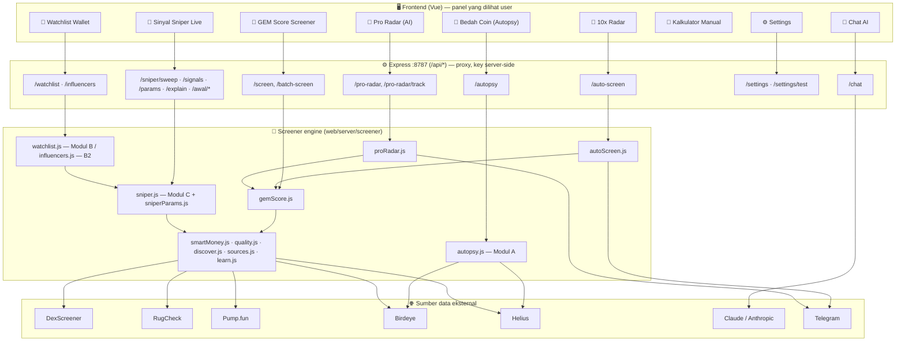
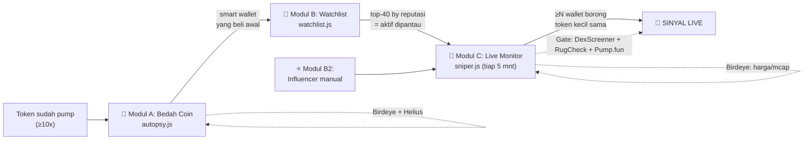
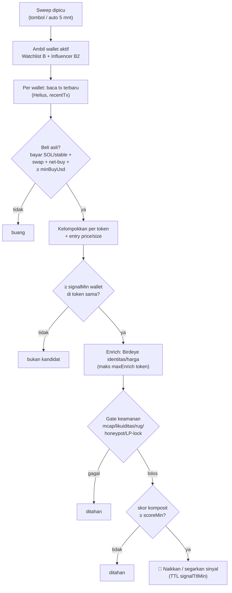
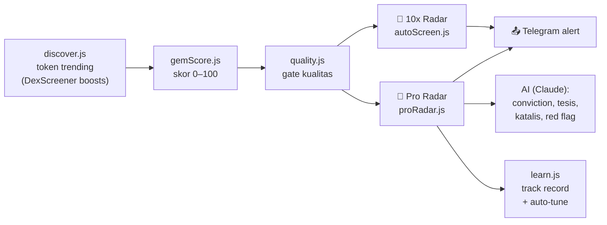
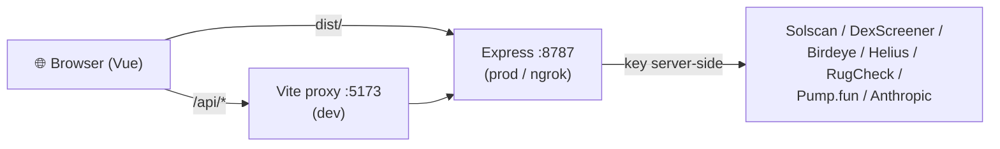
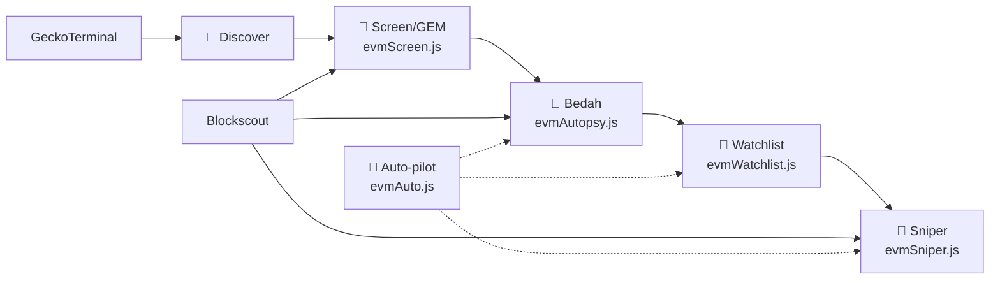

# Peta & Flowchart Semua Tool — Memecoin Screener

> Gambaran menyeluruh semua tool yang sudah dibuat, alur datanya, dan bagaimana
> mereka saling terhubung. Diagram pakai **Mermaid** (otomatis ter-render di
> GitHub). Bahan baca — bukan spec final. Detail parameter: [REKAP-PARAMETER.md](REKAP-PARAMETER.md).

---

## 1. Peta besar — semua tool dalam satu layar



---

## 2. Daftar tool + fungsinya

### A. Tool screening token
| Tool (panel) | Endpoint | Engine | Fungsi singkat |
|---|---|---|---|
| 💎 **GEM Score Screener** | `/screen` | `gemScore.js` | Skor 0–100 satu token: likuiditas, momentum, trust → verdict STRONG/WATCH/SKIP. |
| 🚀 **10x Radar** | `/auto-screen` | `autoScreen.js` | Auto-screen token trending, tampilkan yang potensi tinggi. Scan interval + alert Telegram. |
| 🧠 **Pro Radar (AI)** | `/pro-radar` | `proRadar.js` | Sama seperti 10x Radar + **AI** menilai conviction, tesis, katalis, red flag. Self-learning track record. |
| 🧮 **Kalkulator Manual** | — (client) | — | Input data DexScreener/RugCheck manual → skor. Untuk eyeballing pair by hand. |

### B. SNIPER ENGINE (3 modul berantai)
| Modul | Tool (panel) | Endpoint | Engine | Fungsi |
|---|---|---|---|---|
| **A** | 🔬 **Bedah Coin** | `/autopsy` | `autopsy.js` | Bedah 1 token yang sudah pump → temukan smart wallet yang beli lebih awal (Birdeye + Helius). |
| **B** | 🎯 **Watchlist Smart Wallet** | `/watchlist` | `watchlist.js` | Peringkat wallet dari hasil Bedah (self-learning). Top-40 jadi **aktif dipantau**. |
| **B2** | ⭐ **Watchlist Influencer** | `/influencers` | `influencers.js` | Wallet influencer yang kamu input sendiri. **1 beli** sudah cukup jadi sinyal. |
| **C** | 🎯 **Sinyal Sniper Live** | `/sniper/*` | `sniper.js` | Pantau wallet aktif tiap 5 mnt → sinyal saat ≥N wallet borong token kecil yang sama. |

### C. Infrastruktur / pendukung
| Tool | Endpoint | Fungsi |
|---|---|---|
| ⚙️ **Settings** | `/settings`, `/sniper/params` | Atur key, mode AI, dan **semua parameter Sniper** (runtime, tanpa restart). |
| 💬 **Chat AI** | `/chat` | Tanya-jawab AI dengan akses tool screener (function calling). |
| 📤 **Telegram alert** | (internal) | Push pick radar baru ke Telegram. |
| 🧠 **Self-learning** | `learn.js`, `/pro-radar/track` | Rekam win-rate pick radar, auto-tune ambang. |

---

## 3. Alur SNIPER ENGINE (A → B → C) — inti aplikasi



**Intinya:** makin banyak winner yang kamu **Bedah** → makin pintar **Watchlist** →
makin tajam **Sinyal Live**. Sistem belajar sendiri dari data.

---

## 4. Alur satu sweep Sniper Live (Modul C) — detail



Semua ambang (`signalMin`, `minBuyUsd`, `scoreMin`, gate, TTL, dst.) diatur di
registry `sniperParams.js` — lihat [REKAP-PARAMETER.md](REKAP-PARAMETER.md).

---

## 5. Alur Radar (10x & Pro Radar)



---

## 6. Arsitektur data (kenapa ada server)



**Kunci:** semua API key **tinggal di server** (`web/server/.env`), tidak pernah
ke browser. Browser hanya bicara ke `/api/*`; Express yang memegang rahasia dan
memanggil sumber data eksternal.

---

## 7. Peta file (rujukan cepat)

```
web/
├─ frontend/src/components/panels/
│  ├─ ScreenerPanel.vue      💎 GEM Score
│  ├─ RadarPanel.vue         🚀 10x Radar
│  ├─ ProRadarPanel.vue      🧠 Pro Radar (AI)
│  ├─ AutopsyPanel.vue       🔬 Bedah Coin (A)
│  ├─ WatchlistPanel.vue     🎯 Watchlist (B + B2)
│  ├─ SniperPanel.vue        🎯 Sinyal Sniper Live (C)
│  ├─ ManualScoringPanel.vue 🧮 Kalkulator manual
│  └─ SettingsPanel.vue      ⚙️ Settings
└─ server/
   ├─ index.js               mount semua route
   ├─ routes/                screen · radar · autopsy · influencers · settings · chat · proxy
   ├─ screener/
   │  ├─ gemScore.js · autoScreen.js · proRadar.js
   │  ├─ autopsy.js (A) · watchlist.js (B) · influencers.js (B2)
   │  ├─ sniper.js (C) · sniperParams.js (registry param)
   │  ├─ smartMoney.js · quality.js · discover.js · sources.js · learn.js · telegram.js
   │  └─ .sniper-params.json  ← OVERRIDE parameter (menang atas .env)
   ├─ ai/                     analyze · anthropic · tools · settings · explainSignal
   └─ .env                    semua key + seed SNIPER_*
```

---

## 8. Ringkas alur nilai (mental model)

1. **Bedah** token winner → dapat smart wallet.
2. Smart wallet naik peringkat di **Watchlist** → dipantau live.
3. **Sniper Live** memantau wallet aktif → sinyal saat mereka borong barengan.
4. Paralel, **Radar** memindai pasar & **AI** menilai; alert ke **Telegram**.
5. **Settings** menyetel ketajaman semua ini secara real-time.
6. Semuanya heuristik — **bukan nasihat keuangan. DYOR.**

---

## 9. ⛓️ Ekosistem Robinhood Chain (EVM) — pipeline kembar

Zona terpisah (tombol melayang **Solana ⇄ Robinhood Chain** di UI) yang mem-port
pipeline yang sama ke **Robinhood Chain** (EVM L2). Detail penuh:
[ROBINHOOD-CHAIN.md](ROBINHOOD-CHAIN.md).



| Tool | File | Endpoint |
|---|---|---|
| 🚀 Discover | `routes/robinhood.js` | `/api/robinhood/discover` |
| 💎 Screen / GEM | `screener/evmScreen.js` | `/api/robinhood/screen` |
| 🩻 Bedah Coin | `screener/evmAutopsy.js` | `/api/robinhood/bedah` |
| 👛 Watchlist | `screener/evmWatchlist.js` | `/api/robinhood/watchlist` |
| 🎯 Sniper Live | `screener/evmSniper.js` | `/api/robinhood/sniper/*` |
| 🤖 Auto-pilot | `screener/evmAuto.js` | `/api/robinhood/auto/*` |

**Beda dari Solana:** sumber data = **GeckoTerminal + Blockscout** (tanpa API key,
ganti Helius/Birdeye/DexScreener/RugCheck); gate keamanan **heuristik on-chain**
(GoPlus/Honeypot.is belum dukung chain 4663); watchlist **memantau semua wallet**
(cap pertumbuhan `RH_WATCHLIST_MAX`). Parameter: [REKAP-PARAMETER.md](REKAP-PARAMETER.md#-parameter-robinhood-chain-evm).
