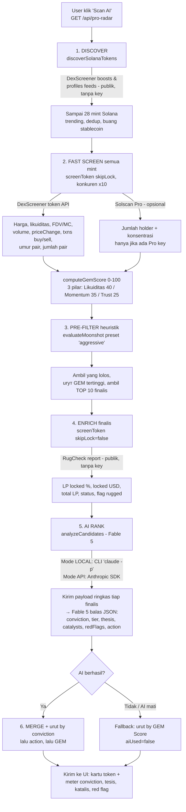

# 🧠 Pro Radar (Fable 5) — alur data & flowchart

Pro Radar adalah versi **bertenaga AI** dari 10x Radar. Funnel penemuan token-nya
sama, tapi finalisnya di-*enrich* dengan data liquidity-lock lalu diperingkat oleh
model **Fable 5** (`claude-fable-5`) yang menilai *conviction*, tesis, katalis, dan
red flag tiap token.

> ⚠️ Heuristik + opini AI dari data pasar publik. **Bukan nasihat keuangan.**
> Memecoin sangat berisiko — DYOR.

Endpoint: `GET /api/pro-radar` · UI: panel **🧠 Pro Radar** (di bawah 10x Radar).

---

## Flowchart (Mermaid)



Kalau Mermaid tak render (mis. di editor biasa), lihat versi ASCII di bawah.

---

## Flowchart (ASCII)

```
          ┌───────────────────────────────────────────────┐
          │  User klik "Scan AI"  →  GET /api/pro-radar     │
          └───────────────────────┬───────────────────────┘
                                   ▼
   1. DISCOVER  ── discover.js ─────────────────────────────────────────────
      Sumber : DexScreener  token-boosts/latest, token-boosts/top,
               token-profiles/latest   (PUBLIK, tanpa API key)
      Ambil  : sampai 28 mint Solana yang lagi "trending", dedup,
               buang USDC/USDT/wSOL
                                   │
                                   ▼
   2. FAST SCREEN (semua mint, paralel x10)  ── screen.js + sources.js ──────
      Sumber : DexScreener  /latest/dex/tokens/<mint>   (PUBLIK)
      Data   : harga, likuiditas USD, marketCap/FDV, volume 1h/6h/24h,
               priceChange 1h/6h/24h, txns buy/sell 24h, umur pair, jumlah pair
      (opsional) Solscan Pro /token/holders → jumlah holder & konsentrasi
                 → hanya jika SOLSCAN_API_KEY Pro terpasang; else dilewati
      Skor   : computeGemScore() → GEM Score 0–100
               (Likuiditas 40 + Momentum 35 + Trust/Age 25)
      Catatan: LP-lock DILEWATI di tahap ini (skipLock) biar cepat
                                   │
                                   ▼
   3. PRE-FILTER heuristik  ── autoScreen.js: evaluateMoonshot() ────────────
      Preset : "aggressive" (jaring lebar): MC ≤ $500k, Liq ≥ $5k,
               GEM ≥ 55, umur 0.5j–14h, buy ratio ≥ 50%
      Hasil  : yang LOLOS → urut GEM tertinggi → ambil TOP 10 (finalis)
                                   │
                                   ▼
   4. ENRICH finalis  ── screen.js (skipLock=false) + sources.js ────────────
      Sumber : RugCheck  /v1/tokens/<mint>/report   (PUBLIK, tanpa key)
      Data   : LP locked %, locked USD, total LP USD, status
               (Locked / Partially / Unlocked), flag "rugged"
                                   │
                                   ▼
   5. AI RANK  ── ai/analyze.js: analyzeCandidates() → FABLE 5 ──────────────
      Input ke model (payload RINGKAS per finalis):
        address, symbol, name, gemScore, marketCap, liquidityUsd,
        volume24h, priceChange 1h/6h/24h, buys/sells 24h, buyRatio%,
        ageHours, pairCount, lockedPct, lockStatus, rugged
      Jalur :
        • Mode LOCAL  → CLI `claude -p ... --model claude-fable-5` (tanpa biaya)
        • Mode API    → Anthropic SDK messages.create (butuh ANTHROPIC_API_KEY)
      Output model (JSON array per token):
        conviction 0–100, tier S/A/B/C, thesis, catalysts[], redFlags[], action
        (APE / WATCH / AVOID)
                                   │
                                   ▼
   6. MERGE + SORT  ── proRadar.js ─────────────────────────────────────────
      AI aktif  → urut: conviction ↓, lalu action, lalu GEM Score
      AI mati   → fallback: urut GEM Score ↓  (aiUsed=false, badge ⚠️ di UI)
                                   │
                                   ▼
              UI: kartu token + meter conviction, tesis,
                  katalis (▲) & red flag (▼), tombol Chart / Buy
```

---

## Tabel sumber data

| Tahap | Fungsi | Sumber data | Perlu key? | Data yang diambil |
|-------|--------|-------------|:---------:|-------------------|
| 1. Discover | `discoverSolanaTokens` | DexScreener boosts/profiles | ❌ | Daftar mint trending |
| 2. Fast screen | `fetchDexScreener` | DexScreener tokens API | ❌ | Harga, likuiditas, MC, volume, priceChange, txns, umur pair |
| 2. (opsional) | `fetchSolscanHolders` | Solscan Pro | ✅ Pro | Jumlah holder, konsentrasi top holder |
| 2. Skor | `computeGemScore` | (lokal) | ❌ | GEM Score 0–100 |
| 3. Pre-filter | `evaluateMoonshot` | (lokal) | ❌ | Lolos/tidak + alasan |
| 4. Enrich | `fetchRugcheckLock` | RugCheck | ❌ | LP locked %, USD, status, rugged |
| 5. AI rank | `analyzeCandidates` | **Fable 5** (CLI lokal / Anthropic API) | Lokal: ❌ · API: ✅ | conviction, tier, thesis, katalis, red flag, action |

---

## 10x Radar vs Pro Radar

| | 🚀 10x Radar | 🧠 Pro Radar (Fable 5) |
|--|--------------|------------------------|
| Discovery | DexScreener trending | DexScreener trending (jaring lebih lebar, 28) |
| GEM Score | ✅ | ✅ |
| Liquidity lock (RugCheck) | ❌ (dilewati, biar cepat) | ✅ (di-enrich untuk finalis) |
| Peringkat AI (Fable 5) | ❌ | ✅ conviction + tesis + red flag |
| Urutan | GEM Score | Conviction AI (fallback GEM) |
| Kecepatan | Cepat | Lebih lambat (ada langkah enrich + AI) |
| Endpoint | `/api/auto-screen` | `/api/pro-radar` |

## Cara pakai AI-nya

- **Mode Local** (default, tanpa biaya): butuh CLI `claude` di mesin yang menjalankan
  server. Model diatur ke `claude-fable-5`.
- **Mode API** (untuk hosting publik): set provider Claude + isi Anthropic API key di
  **Settings**, pilih model `claude-fable-5`.
- Kalau AI tak tersedia, Pro Radar tetap jalan memakai urutan heuristik dan menandai
  `⚠️ AI tak aktif` di UI.
