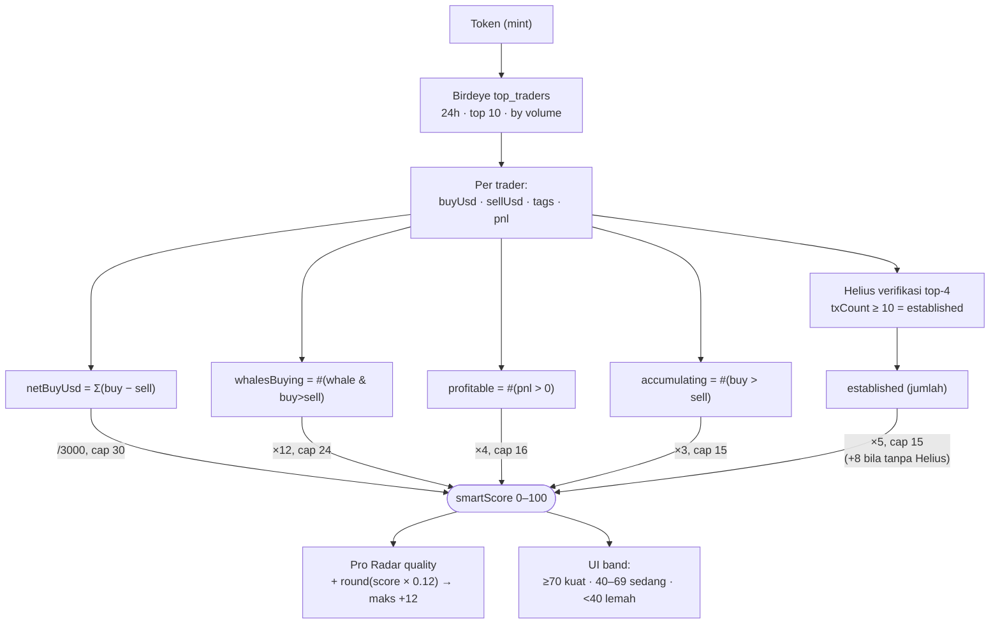

# Rekap Parameter — Memecoin Screener / Sniper Engine

> Ringkasan semua parameter yang bisa diatur, dari mana asalnya, dan **nilai
> efektif saat ini**. Dibuat sebagai bahan baca. Sumber kebenaran ada di kode:
> `web/server/screener/sniperParams.js` (registry), `web/server/.env` (seed),
> `web/server/screener/.sniper-params.json` (override Settings UI).

---

## ⚠️ Urutan prioritas (WAJIB paham dulu)

Nilai tiap parameter Sniper ditentukan dengan urutan **menang dari kiri**:

```
.sniper-params.json  >  .env (SNIPER_*)  >  default di kode
   (Settings UI)          (seed)             (PARAM_DEFS)
```

Artinya: **kalau sebuah key ada di `.sniper-params.json`, nilai di `.env` untuk
key itu DIABAIKAN.** Ini sering bikin bingung — kamu ubah `.env` tapi tidak ada
efek karena masih tertimpa override dari Settings UI.

- Override disimpan di `web/server/screener/.sniper-params.json` (gitignored).
- Set `null` pada sebuah key (via Settings/POST) = **reset ke seed `.env`/default**.
- Perubahan lewat Settings UI langsung berlaku di **sweep berikutnya** (tanpa restart).
- Perubahan lewat `.env` butuh **restart server**.

---

## 🎯 Parameter Sniper Live (Modul C) — registry `sniperParams.js`

Kolom **Efektif** = nilai yang benar-benar dipakai sweep sekarang (hasil urutan
prioritas di atas). **Cetak tebal** = sedang di-override oleh `.sniper-params.json`.

### Grup: Deteksi beli
| Key | env seed | Default | .env kita | Override | **Efektif** | Arti |
|---|---|---|---|---|---|---|
| `requireSwap` | `SNIPER_REQUIRE_SWAP` | `true` | — | — | `true` | Hanya hitung beli dari swap asli yang membayar (SOL/stable keluar). Buang airdrop/kiriman. |
| `minBuyUsd` | `SNIPER_MIN_BUY_USD` | `100` | — | — | `100` | Abaikan test-buy dust di bawah nilai ini. |
| `netBuyOnly` | `SNIPER_NET_BUY_ONLY` | `true` | — | — | `true` | Wallet yang beli lalu jual lagi (net ≤ 0) tak dihitung akumulasi. |
| `lookbackMin` | `SNIPER_LOOKBACK_MIN` | `90` | `360` | `180` | **`180`** | Hanya perhitungkan beli lebih baru dari ini (menit). |
| `recentTx` | `SNIPER_RECENT_TX` | `20` | `50` | — | **`50`** | Jumlah tx terbaru per wallet yang dibaca dari Helius. |

### Grup: Konfluensi & skor
| Key | env seed | Default | .env kita | Override | **Efektif** | Arti |
|---|---|---|---|---|---|---|
| `signalMin` | `SNIPER_SIGNAL_MIN` | `2` | `1` | `2` | **`2`** | Jumlah wallet berbeda (net-buy) di token sama agar jadi kandidat. |
| `cobuyWindowMin` | `SNIPER_COBUY_WINDOW_MIN` | `15` | `1440` | `30` | **`30`** | Beli dalam rentang ini dianggap terkoordinasi → nambah skor (menit). |
| `repWeighted` | `SNIPER_REP_WEIGHTED` | `true` | — | — | `true` | Skor = Σ reputasi wallet (bukan sekadar jumlah kepala). |
| `scoreMin` | `SNIPER_SCORE_MIN` | `150` | `0` | `240` | **`240`** | Sinyal di bawah skor komposit ini ditahan. |

### Grup: Gate keamanan
| Key | env seed | Default | .env kita | Override | **Efektif** | Arti |
|---|---|---|---|---|---|---|
| `safetyGate` | `SNIPER_SAFETY_GATE` | `true` | — | — | `true` | Wajib lolos DexScreener + RugCheck + Pump.fun sebelum sinyal tampil. |
| `allowUnknownMcap` | `SNIPER_ALLOW_UNKNOWN_MCAP` | `true` | — | — | `true` | Tampilkan token fresh (Birdeye belum kenal) dengan label `unverified`. |
| `minMcap` | `SNIPER_MIN_MCAP` | `20000` | `20000` | `20000` | **`20000`** | Lantai mcap — buang token mikro/mati (USD). Batas minimal dinaikkan ke $20rb. |
| `maxMcap` | `SNIPER_SIGNAL_MAX_MCAP` | `2000000` | `10000000` | `1500000` | **`1500000`** | Batas atas mcap — kebesaran = terlambat (USD). |
| `minLiquidity` | `SNIPER_MIN_LIQUIDITY` | `8000` | `1000` | `10000` | **`10000`** | Lantai likuiditas DexScreener (USD). |
| `minLockedPct` | `SNIPER_MIN_LOCKED_PCT` | `0` | — | `30` | **`30`** | Tolak bila RugCheck kembalikan LP-locked di bawah ini (%). |

### Grup: Mesin
| Key | env seed | Default | .env kita | Override | **Efektif** | Arti |
|---|---|---|---|---|---|---|
| `maxEnrich` | `SNIPER_MAX_ENRICH` | `20` | `40` | — | **`40`** | Batas kandidat teratas yang di-enrich Birdeye + gate per sweep. |
| `signalTtlMin` | `SNIPER_SIGNAL_TTL_MIN` | `360` | `1440` | `240` | **`240`** | Umur sinyal; yang tak diperbarui lebih lama dari ini dihapus (menit). |

> **Kesimpulan penting:** override `.sniper-params.json` membuat profil saat ini
> **cukup ketat** (skor ≥240, LP-locked ≥30%, likuiditas ≥$10rb). Pelonggaran di
> `.env` (signalMin=1, scoreMin=0, dst.) **sebagian besar tertimpa**. Untuk
> benar-benar melonggarkan, ubah lewat **Settings UI** atau hapus/kosongkan file
> `.sniper-params.json`.

---

## 🔁 Varian sinyal Sniper: `v2` vs `awal`

Satu mesin, dua aliran sinyal (store terpisah):

| | **v2** (utama) | **awal** (baseline) |
|---|---|---|
| Profil | Registry di atas (bisa diedit runtime) | **FIXED, longgar, tak bisa diedit** |
| `signalMin` | efektif `2` | `2` |
| `safetyGate` | `true` | `false` |
| `netBuyOnly` / `repWeighted` / dust | on | **off** |
| Endpoint | `/api/sniper/sweep`, `/api/sniper/signals` | `/api/sniper/awal/sweep`, `/api/sniper/awal/signals` |
| Tujuan | Sinyal tajam & aman | Pembanding "apa adanya" (headcount murni) |

Profil `awal` (dari `sniper.js`): `signalMin 2, maxMcap 2jt, minMcap 20rb, minLiquidity
0, scoreMin 0, cobuyWindow 15, lookback 90, recentTx 20, ttl 360, requireSwap
false, allowUnknownMcap true, netBuyOnly false, minBuyUsd 0, repWeighted false,
safetyGate false`.

---

## 👛 Parameter Watchlist (Modul B) — `watchlist.js`

| Key env | Default | Arti |
|---|---|---|
| `SNIPER_WATCH_SIZE` | `40` | Berapa wallet teratas (by reputasi) yang **aktif** dipantau Modul C. |
| `SNIPER_POLL_MIN` | `5` | Interval monitor live (menit). |
| `SNIPER_WINNER_MIN_X` | `10` | Definisi "winner": token pump ≥ Nx dari launch → wallet-nya direkam. |

---

## 📡 Parameter Radar (10x Radar & Pro Radar)

| Key env | Default | Arti |
|---|---|---|
| `RADAR_INTERVAL_MIN` | `15` | Interval auto-scan radar (menit). |
| `RADAR_PRESET` | `balanced` | Preset filter radar. |
| `RADAR_GRADE_AFTER_MIN` | `180` | Setelah berapa menit pick di-grade (self-learning track record). |

---

## 🧠 Kategori Smart Money — `smartMoney.js`

> **Beda dengan reputasi Watchlist.** Ada DUA konsep "smart money" di app ini:
> 1. **Smart Money score (bab ini)** — dihitung dari **Birdeye top-traders + Helius**
>    untuk SATU token. Dipakai oleh **GEM Screener & Pro Radar** (badge/meter "🧠 Smart").
> 2. **Reputasi Watchlist** (Modul B) — wallet yang berulang menangkap winner; dipakai
>    oleh **Sniper Live** (`repWeighted`, `scoreMin`). Lihat tabel Sniper di atas.
>
> Bab ini menjelaskan **#1**.

### Sumber & input (dari mana angkanya)
| Sumber | Ambil apa | Detail |
|---|---|---|
| **Birdeye** `top_traders` | WHO trading token ini | `time_frame=24h`, **top 10** by volume. Per trader: `buyUsd`, `sellUsd`, `trades`, `tags` (whale/bundler…), `pnl`. |
| **Helius** wallet activity | Wallet-nya REAL atau throwaway | Verifikasi **top 4** trader; `txCount ≥ 10` → dihitung **established** (mapan). Opsional. |

### Sinyal turunan (dihitung dari 10 top trader)
| Nama | Rumus | Arti |
|---|---|---|
| `netBuyUsd` | Σ(`buyUsd` − `sellUsd`) | Tekanan beli bersih (USD). |
| `accumulating` | jumlah trader `buyUsd > sellUsd` | Berapa yang net-beli (breadth). |
| `whales` | jumlah trader ber-tag `whale` | Jumlah whale. |
| `whalesBuying` | jumlah `whale` **dan** `buyUsd > sellUsd` | Whale yang sedang akumulasi (sinyal terkuat). |
| `profitable` | jumlah trader `pnl > 0` | Trader yang lagi profit. |
| `established` | jumlah top-4 dengan `txCount ≥ 10` (Helius) | Wallet mapan (bukan sniper sekali pakai). |

### Bobot skor → `smartScore` (0–100)
| Komponen | Rumus | Cap poin | Ambang penuh |
|---|---|---|---|
| Tekanan beli bersih | `netBuyUsd / 3000` | **30** | net-buy ≥ $90rb |
| Whale akumulasi | `whalesBuying × 12` | **24** | 2 whale beli |
| Trader profit | `profitable × 4` | **16** | 4 trader profit |
| Breadth (net-buyer) | `accumulating × 3` | **15** | 5 trader net-beli |
| Wallet mapan (Helius) | `established × 5` (atau **+8** flat bila Helius mati) | **15** | 3 wallet mapan |

`smartScore = clamp(0, 100, Σ komponen)`. **Wajib `BIRDEYE_API_KEY`** (tanpa itu
fitur mati → `null`). Helius hanya memperkuat (verifikasi wallet).

### Dipakai di mana
| Pemakai | Efek |
|---|---|
| **Pro Radar** quality | `quality += round(smartScore × 0.12)` → **maks +12** poin. |
| **UI badge/meter** | Band warna: **≥70 kuat** · **40–69 sedang** · **<40 lemah**. |
| **Enable** | `smartMoneyEnabled = Boolean(BIRDEYE_API_KEY)`. |

### 🔀 Flowchart — perhitungan Smart Money



---

## 🚦 Rate limit & kuota (index.js / middleware)

| Key env | Default | Arti |
|---|---|---|
| `RATE_LIMIT_MAX` | `120` | Maks request `/api/*` per menit (global). |
| `SCAN_RATE_MAX` | `6` | Maks sweep/scan berat per menit (sniper sweep, pro-radar, dst). |
| `CHAT_RATE_MAX` | `8` | Maks pesan chat AI per menit. |
| `CHAT_DAILY_MAX` | `200` | Maks pesan chat AI per hari. |

> Kalau tombol **Sweep sekarang** balik error *"Terlalu banyak permintaan (scan)"*,
> itu `SCAN_RATE_MAX` (6/menit). Tunggu sebentar.

---

## 🔑 Key & kredensial (`.env`, server-side, gitignored)

| Key env | Dipakai untuk |
|---|---|
| `HELIUS_API_KEY` | Baca transaksi wallet (deteksi beli Modul C, verifikasi wallet). |
| `BIRDEYE_API_KEY` | Top trader / smart money, identitas & harga token. |
| `ANTHROPIC_API_KEY` | AI (Pro Radar, Chat, Jelaskan sinyal) — bila mode `api`. |
| `SOLSCAN_API_KEY` | MCP/Solscan (opsional; free tier terbatas). |
| `TELEGRAM_BOT_TOKEN` / `TELEGRAM_CHAT_ID` | Push alert radar ke Telegram. |
| `AI_MODE` | `local` (CLI `claude`) atau `api` (pakai `ANTHROPIC_API_KEY`). |
| `PORT` | Port server Express (default `8787`). |

> ⚠️ Catatan riwayat: pernah ada bug di `.settings.json` — `heliusKey` tersimpan
> sebagai `"HELIUS_API_KEY=9bd48c...”` (seluruh baris, bukan value). Ini bikin
> semua panggilan Helius 401 → Sniper 0 sinyal. Sudah diperbaiki jadi value murni.

---

## 🛠️ Cara mengubah parameter

1. **Lewat Settings UI** (disarankan) → tersimpan ke `.sniper-params.json`,
   berlaku di sweep berikutnya, tanpa restart. Endpoint: `POST /api/sniper/params`.
2. **Lewat `.env`** (`SNIPER_*`) → jadi seed default, **tapi kalah** dari override.
   Butuh restart. Hanya berpengaruh untuk key yang **tidak** ada di override.
3. **Reset** sebuah key ke default → kirim `null` untuk key itu (Settings/POST),
   atau hapus baris-nya di `.sniper-params.json`.
