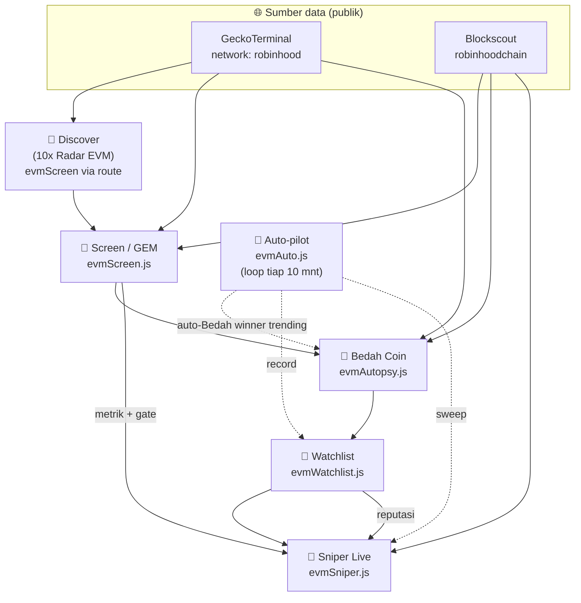

# Ekosistem Robinhood Chain (EVM) — Pipeline Smart Money

> Port lengkap engine "Smart Money Tracking" ke **Robinhood Chain** (Ethereum L2,
> EVM, mainnet 1 Juli 2026). Zona terpisah di bawah ekosistem Solana, diakses lewat
> tombol melayang **Solana ⇄ Robinhood Chain** di UI. Semua data **on-chain nyata**
> (tanpa data palsu). Heuristik — bukan nasihat keuangan. DYOR.
>
> Rujukan silang: parameter di [REKAP-PARAMETER.md](REKAP-PARAMETER.md#-parameter-robinhood-chain-evm),
> peta tool di [PETA-TOOL.md](PETA-TOOL.md).

---

## 1. Kenapa & fakta chain

Robinhood Chain adalah **EVM L2 (Arbitrum stack)** permissionless — siapa pun bisa
deploy kontrak — dan seminggu pertama justru ramai **memecoin** ("meme meta"). Jadi
konsep sniper smart money **relevan** di sana, hanya butuh adapter data EVM.

| Aspek | Nilai |
|---|---|
| Jenis | Ethereum L2, EVM (Arbitrum stack), gas ETH, block ~100ms |
| Chain ID | **4663** (`0x1237`) |
| Sifat | Permissionless (deploy bebas) |
| DEX utama | Uniswap (+ 1inch, Lighter, Rialto, Arcus) |
| Launchpad | fun.noxa.fi/robinhood |
| WETH | `0x0bd7d308f8e1639fab988df18a8011f41eacad73` |
| USDG (stable) | `0x5fc5360d0400a0fd4f2af552add042d716f1d168` |

### Sumber data (publik, tanpa API key)
| Sumber | Dipakai untuk |
|---|---|
| **GeckoTerminal** (network id `robinhood`) | Pool trending/new, harga, likuiditas, volume, tx buys/sells |
| **Blockscout** (`robinhoodchain.blockscout.com`) | Transfer token (asc/desc), saldo wallet, holder, verifikasi kontrak |

> ⚠️ **Scanner rug siap-pakai belum mendukung chain 4663** (GoPlus: "main chain not
> supported", Honeypot.is: "invalid chain"). Karena itu gate keamanan kita **heuristik
> on-chain** (likuiditas + holder + konsentrasi + honeypot dari rasio buys/sells),
> bukan simulasi honeypot penuh. Tinggal ditancapkan saat provider menambah chain ini.

---

## 2. Pipeline (5 modul + auto-pilot)

Cerminan pipeline Solana (GEM → Radar → Bedah → Watchlist → Sniper), di EVM:

### Modul & endpoint
| # | Modul | File | Endpoint | Fungsi |
|---|---|---|---|---|
| 1 | **Discover** (10x Radar EVM) | `routes/robinhood.js` | `GET /api/robinhood/discover` | Trending + new pools (GeckoTerminal), saring lantai likuiditas, urut volume 24j. |
| 2 | **Screen / GEM** | `screener/evmScreen.js` | `GET /api/robinhood/screen?token=` | Metrik + gate keamanan heuristik + skor 0–100 + verdict STRONG/WATCH/SKIP. |
| 3 | **Bedah Coin** | `screener/evmAutopsy.js` | `GET /api/robinhood/bedah?token=` | Early buyer dari transfer paling awal (Blockscout asc; beli = `pool→wallet`) + konfirmasi saldo live → kandidat smart wallet. |
| 4 | **Watchlist** | `screener/evmWatchlist.js` | `GET /api/robinhood/watchlist`, `POST /watchlist/record` | Rekam kandidat → reputasi 0–100 → ranking. **Memantau SEMUA wallet** (tanpa batas). |
| 5 | **Sniper Live** | `screener/evmSniper.js` | `GET /api/robinhood/sniper/signals`, `GET /sniper/sweep` | Sweep wallet watchlist, deteksi beli, sinyal saat konfluensi + gate + hold-tracking. |
| — | **Auto-pilot** | `screener/evmAuto.js` | `GET /auto/status`, `POST /auto/seed`, `POST /auto/tick` | Loop background: auto-Bedah winner trending → record → sweep. |

---

## 3. Deteksi beli/jual di EVM (kunci)

Tanpa parsing swap khusus — cukup **event transfer ERC-20** + identitas pool:

- **Beli** = wallet **menerima** token non-base **dari pool** (Bedah), atau menerima
  token non-base **dan membayar** WETH/USDG di tx yang sama (Sniper).
- **Jual** = kebalikannya (`wallet → pool`, atau kirim token + terima WETH/USDG).

Bedah memakai `tokentx&sort=asc` (mundur ke blok genesis) untuk menemukan pembeli
launch; Sniper memakai `tokentx&sort=desc` (tx terbaru) untuk mendeteksi beli aktif.

---

## 4. Auto-pilot (menumbuhkan watchlist sendiri)

Masalah klasik "watchlist kosong / wallet pasif" diselesaikan otomatis: tiap tick,
`evmAuto.js` mem-**Bedah winner trending** (mcap ≥ ambang) → merekam early-buyer
aktif ke watchlist → lalu **Sniper sweep**. Terbukti menumbuhkan watchlist **4 → 274
wallet** otomatis.

Ketahanan:
- **Timeout 12s** di semua fetch EVM (cegah tick menggantung).
- **Mutex** cegah tick tumpang-tindih yang membanjiri Blockscout.
- **Dedup** (`seededAt`) hindari re-bedah token sama.
- **Cap pertumbuhan** `RH_WATCHLIST_MAX` (default 300): berhenti menambah wallet baru
  saat penuh — sweep tak makin lama tanpa henti. Wallet lama **tetap dipantau** (bukan
  dipangkas).

---

## 5. Skor & gate (ringkas)

**Screen/GEM (0–100):** kedalaman likuiditas + turnover (vol/liq) + sebaran pembeli +
tekanan beli + momentum 24j. Gate keamanan heuristik menolak: likuiditas tipis,
honeypot (buys > 0 tapi sells = 0), reputasi 'scam' Blockscout, holder sangat sedikit,
konsentrasi top-holder tinggi (LP dikecualikan).

**Reputasi Watchlist (0–100):** jumlah winner ditangkap (dominan) + seberapa awal beli
(`buyIdx`). Hanya token **winner** (mcap ≥ `RH_WINNER_MIN_MCAP`) yang dikreditkan.

**Sniper:** skor sinyal = Σ reputasi wallet + bumbu skor screen. Hold-tracking:
buang sinyal saat holders < `signalMin` & sudah jual; urut by jumlah holder.

---

## 6. Status & keterbatasan (jujur)

- ✅ Pipeline lengkap live dengan data nyata (CASHCAT $108jt→$123jt terverifikasi:
  4 kandidat smart wallet diamond-hand ditemukan).
- ⚠️ **Sinyal Sniper bisa 0** — butuh ≥2 wallet watchlist membeli token fresh yang
  SAMA saat itu. Wallet yang di-seed adalah *early-buyer-that-holds* (reputable tapi
  belum tentu aktif trading detik ini). Sinyal muncul otomatis seiring waktu.
- ⚠️ **Gate keamanan heuristik**, bukan honeypot-sim penuh (chain terlalu baru).
- ⚠️ **Sweep lambat** saat watchlist besar (Blockscout publik ke-rate-limit) — di-mitigasi
  cap pertumbuhan + timeout + mutex.

Semua parameter env di [REKAP-PARAMETER.md](REKAP-PARAMETER.md#-parameter-robinhood-chain-evm).
