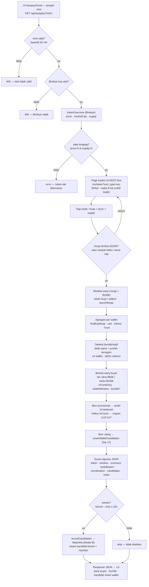
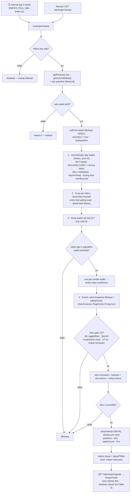
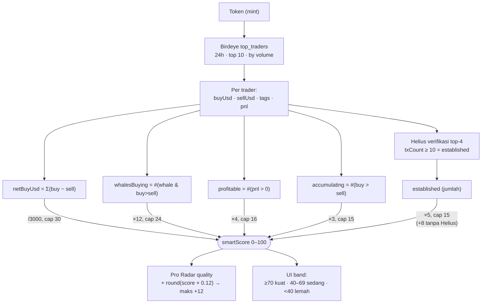

# SNIPER ENGINE — Diskusi & Perkembangan

> File hidup. Kita update tiap ada keputusan. Status paling bawah.
> Dibuat: 2026-07-05. Owner: user. Pendamping: Claude Code.

---

## 🎯 Goal besar (kata-kata user)

> "Bikin tool yang **membedah coin yang lagi naik pesat** (ratusan sampai ribuan
> persen) — melacak pergerakan di balik kenaikannya. Tujuannya biar web/app ini
> jadi **sniper crypto** yang sesungguhnya: menemukan token yang **sedang
> diakumulasi SEBELUM naik**, biar bisa masuk sebelum pump ratusan/ribuan persen.
> Terutama lewat pergerakan **smart money**."

Dua kemampuan yang diminta, dan keduanya sisi dari koin yang sama:

1. **BEDAH (forensik)** — ambil token yang SUDAH pump 100–1000%, bongkar
   *bagaimana* dan *siapa* di baliknya: wallet mana yang beli duluan (sebelum
   naik), kapan akumulasi terjadi, apakah terkoordinasi, dari mana dana wallet itu.
2. **SNIPER (deteksi dini)** — temukan token yang menunjukkan *pola akumulasi yang
   sama* SEBELUM harganya bergerak, lalu kasih alert biar bisa masuk awal.

**Insight kunci:** forensik itu **bahan bakar** buat sniper. Kalau kita bisa bedah
puluhan pemenang dan tahu *wallet mana yang berulang kali menangkap winner lebih
awal*, kita dapat **daftar smart wallet**. Pantau wallet itu secara live → begitu
mereka mulai akumulasi token baru → **itu sinyal snipernya.** Loop-nya:

```
BEDAH winner  →  ekstrak "smart wallet" yang masuk awal  →  WATCHLIST
                                                              │
        alert "masuk sekarang"  ←  MONITOR live watchlist ←──┘
```

---

## 🧱 Yang SUDAH ada (fondasi — jangan bangun ulang)

| Komponen | File | Apa yang dilakukan | Batasnya untuk goal ini |
|---|---|---|---|
| Discovery | `screener/discover.js` | Ambil token trending dari DexScreener boosts/profiles | Ini token yang **sudah** dapat perhatian → sering **sudah** mulai naik. Lemah untuk "masuk SEBELUM naik". |
| Smart money | `screener/smartMoney.js` | Birdeye top_traders 24h + Helius verifikasi wallet → `smartScore` 0–100 | **Reaktif** — lihat top trader 24h terakhir (10 wallet). Tidak lihat *early buyer*, *funding*, *timing sebelum pump*, dan tidak ingat wallet lintas token. |
| Pro Radar | `screener/proRadar.js` | discover → screen → gate → AI rank (Fable 5) | Bagus untuk kualitas, tapi masih reaktif. |
| Self-learning | `screener/learn.js` | Rekam pick, grade hasil, tuning threshold | Bisa dipakai ulang untuk grade "prediksi sniper". |

**Keys tersedia:** Birdeye + Helius (dua-duanya aktif di `.env`).

---

## 🕳️ Gap yang harus diisi (kenapa fondasi belum cukup jadi sniper)

1. **Belum ada analisis EARLY BUYER.** `smartMoney.js` lihat 24h top trader, bukan
   "siapa yang beli di jam pertama / saat mcap masih kecil". Untuk bedah pump, kita
   butuh data transaksi lebih dalam (Helius / Birdeye trades).
2. **Belum ada MEMORI wallet lintas token.** Tidak ada tempat menyimpan "wallet X
   sudah 4× menangkap winner lebih awal". Ini crown jewel yang hilang.
3. **Belum ada MONITOR live.** Tidak ada yang memantau wallet pilihan dan alert saat
   mereka beli sesuatu yang baru.
4. **Discovery kurang "dini".** DexScreener boosts = sudah rame. Perlu sumber yang
   lebih hulu (mis. pool/pair baru, first swaps) — perlu dibahas kelayakannya.

---

## 🧩 Arsitektur yang diusulkan (draf — belum final, ini bahan diskusi)

Dipecah jadi 3 modul yang bisa dibangun bertahap:

**Modul A — Forensik "Bedah Coin" (`autopsy`)**
Input: 1 mint token yang sudah pump. Output: laporan siapa-kapan-bagaimana.
- Ambil riwayat swap awal (Helius) → identifikasi *early buyers* (sebelum harga X naik)
- Cluster wallet: yang didanai dari sumber sama / beli di window sama = terkoordinasi
- Timeline: kapan akumulasi mulai vs kapan harga meledak
- Skor "kualitas early buyer": berapa yang wallet mapan vs fresh
- ➡️ Menghasilkan kandidat wallet untuk watchlist

**Modul B — Smart Wallet Watchlist (`wallets`)**
Store persisten (mirip `radarStore`/`learn`).
- Simpan wallet dari Modul A + track record-nya (berapa winner ditangkap, hit-rate)
- Reputasi wallet naik/turun otomatis dari hasil (nyambung ke `learn.js`)

**Modul C — Live Sniper Monitor (`sniper`)**
- Pantau watchlist Modul B secara berkala
- Deteksi saat ≥N smart wallet mulai akumulasi 1 token baru → **alert**
- Alert lewat UI + Telegram (`telegram.js` sudah ada)

---

## ❓ Keputusan yang perlu diambil (diskusi)

- [ ] **D5. Skala watchlist.** Berapa wallet dipantau, seberapa sering polling
      (biaya API vs kecepatan sinyal)? (relevan di Modul B/C) **← sedang dibahas**
*(Semua keputusan Modul A sudah diambil — lihat bawah. Sisa D4/D5 untuk Modul B/C.)*

---

## 📌 Keputusan yang SUDAH diambil

- **D1 → Mulai dari Modul A (Forensik/Bedah).** Bangun tool bongkar early-buyer
  dulu; hasilnya jadi bahan watchlist. (2026-07-05)
- **D3 → "Early" = market cap kecil.** Early buyer = wallet yang beli saat mcap
  token masih di bawah ambang tertentu. Angka pastinya = D6. (2026-07-05)
- **D2 → RESOLVED: data cukup di tier sekarang.** Tes live membuktikan Birdeye
  `GET /defi/txs/token?sort_type=asc` (200 OK) mengembalikan trade token dari
  paling lama: `owner`, `side` (buy/sell), `blockUnixTime`, dan **harga per trade**
  → mcap-saat-trade bisa direkonstruksi → early buyer (mcap kecil) bisa disaring.
  Helius mint tx history (200 OK, tokenTransfers) untuk verifikasi/funding. Tanpa
  upgrade API. (2026-07-05)
- **D6 → Dua tier.** ultra-early (mcap < $50k) & early (mcap < $100k). Laporan
  tandai keduanya. (2026-07-05)
- **D7 → Keempat field wajib ada:** (1) daftar early buyer + PnL, (2) sinyal
  koordinasi/bundle, (3) kualitas wallet (mapan/fresh via Helius), (4) kandidat
  smart wallet (jembatan ke Modul B). (2026-07-05)
- **D4 → Dilewati.** Tanpa alert channel khusus untuk sekarang; Modul C cukup
  tampil di UI. Telegram bisa ditambah nanti kalau perlu. (2026-07-06)
- **D5 → Seimbang + auto-track-record.** Watchlist aktif = 40 wallet terbaik,
  monitor tiap 5 menit (~480 call/jam; tunable via env). Wallet masuk OTOMATIS dari
  hasil Bedah Coin, diberi peringkat sesuai rekam jejak (berapa winner tertangkap);
  self-learning. (2026-07-06)

---

## 🔧 SPEC FINAL — Modul A "Bedah Coin" (siap bangun)

**Endpoint:** `GET /api/autopsy?mint=<mint>` → file `web/server/screener/autopsy.js`
+ route di `web/server/routes/`. UI: kartu/panel baru di frontend.

**Algoritma:**
1. Ambil metadata token + total supply + harga sekarang/puncak (Birdeye).
2. Paginate `txs/token?sort_type=asc` (oldest-first). Untuk tiap trade `buy`,
   hitung `mcapSaatItu = price × supply`. **Berhenti nge-page begitu mcap tembus
   $100k** — ini otomatis membatasi jumlah panggilan API (bounded cost).
3. Kelompokkan early buyer per wallet: total beli, mcap saat masuk pertama,
   tandai tier (ultra-early <$50k / early <$100k).
4. Untuk tiap wallet, cek trade berikutnya (masih hold / sudah jual) → estimasi PnL.
5. **Koordinasi/bundle:** kelompokkan wallet per sumber dana (Helius) & per jendela
   waktu beli yang berdekatan → tandai kemungkinan insider/bundle.
6. **Kualitas wallet:** Helius `txCount` → mapan (≥10) vs fresh.
7. **Ranking kandidat smart wallet:** early + wallet mapan + PnL positif + bukan
   bundle → skor tinggi → daftar calon watchlist (Modul B).
8. Output JSON laporan (lihat field D7). Degradasi aman: gagal → field null,
   tidak pernah throw (pola sama seperti `smartMoney.js`).

**Batasan yang disepakati:** cap kedalaman pagination (mis. maks ~500 trade /
sampai mcap>$100k, mana dulu) biar hemat kuota API; `log`/catat kalau kena cap.

---

## 🔀 Flowchart — Modul A "Bedah Coin"

Alur nyata dari klik "Bedah" di UI sampai kandidat smart wallet + auto-record ke
Watchlist. Sumber: `web/server/routes/autopsy.js` (`GET /api/autopsy?mint=`) →
`web/server/screener/autopsy.js` (`runAutopsy`) → `watchlist.js` (`recordCandidates`).
Konstanta: `ULTRA_EARLY_MCAP=$50k`, `EARLY_MCAP=$100k`, `PAGE_SIZE=50`,
`MAX_PAGES=8` (≤400 trade), `HELIUS_CHECK_LIMIT=10`, winner = `launch→now ≥ 10x`.

### Mermaid



### ASCII

```
        ┌─────────────────────────────────────────────┐
        │  UI AutopsyPanel — tempel mint token         │
        │  GET /api/autopsy?mint=<mint>                │
        └───────────────────────┬─────────────────────┘
                                 ▼
              mint base58 32–44 ?  ──tidak──►  400 mint tidak valid
                                 │ ya
                                 ▼
              Birdeye key ada ?   ──tidak──►  400 Birdeye wajib
                                 │ ya
                                 ▼
        ┌─────────────────────────────────────────────┐
        │  tokenOverview (Birdeye)                     │
        │  price · marketCap · supply(=mc/price)       │
        └───────────────────────┬─────────────────────┘
                                 ▼
          price>0 & supply>0 ?  ──tidak──►  error token tak ditemukan
                                 │ ya
                                 ▼
        ┌─────────────────────────────────────────────┐   loop
        │  Page trades OLDEST-first (sort_type=asc)    │◄────────┐
        │  50/hal · maks 8 hal (≤400 trade)            │         │
        │  tiap trade: mcap = price × supply           │         │
        └───────────────────────┬─────────────────────┘         │
                                 ▼                               │
          mcap tembus $100k / habis / kena cap ? ──belum────────┘
                                 │ ya
                                 ▼
        ┌─────────────────────────────────────────────┐
        │  Window early (mcap < $100k)                 │
        │  buys · sellers · launchMcap                 │
        │  agregasi per wallet (firstBuyMcap, usd…)    │
        │  deteksi bundle (detik sama + seragam ≥4 w)  │
        │  tier: ultra-early <$50k / early <$100k      │
        └───────────────────────┬─────────────────────┘
                                 ▼
        ┌─────────────────────────────────────────────┐
        │  Skor provisional → 10 terbersih             │
        │  Helius txCount → mapan (≥10 tx) ?           │
        │  skor ulang → smartWalletCandidates (top 12) │
        └───────────────────────┬─────────────────────┘
                                 ▼
                   winner? launch→now ≥ 10x
                    ┌──────────┴──────────┐
                 ya │                     │ tidak
                    ▼                     ▼
        recordCandidates →           skip (tak direkam)
        Watchlist (Modul B)               │
                    └──────────┬──────────┘
                                 ▼
        Response JSON → UI: early buyer · bundle · kandidat smart wallet
```

> Catatan: untuk token lama, trade paling awal yang terindeks Birdeye bisa sudah
> di atas $100k → tak ada window early (`noEarlyData`). Tool paling akurat untuk
> token yang **baru** naik (riwayat lengkap tersedia).

---

## 🔀 Flowchart — Modul C "Sniper Live" (Live Monitor)

Bagian yang membuat loop **hidup**: tiap `SNIPER_POLL_MIN` (default 5 menit) sistem
menyapu wallet watchlist aktif (Modul B), membaca buy terbaru mereka (Helius), dan
memunculkan **sinyal** saat ≥`signalMin` wallet berbeda meng-akumulasi token kecil
yang sama. Sumber: `index.js` (interval) + `routes/autopsy.js`
(`/api/sniper/sweep`, `/signals`) → `screener/sniper.js` (`runSniperSweep`).
Semua ambang bisa diubah live dari Settings (`sniperParams.js`, dibaca per-sweep).

### Mermaid



### ASCII

```
   ⏱️ interval 5 menit (index.js)  ─┐
   manual GET /api/sniper/sweep   ─┴──►  runSniperSweep
                                             │
                        Helius key ? ──tidak──►  disabled (dilewati)
                                             │ ya
                getParams() live · getActiveWallets() (top watchlist Modul B)
                                             │
                         ada wallet aktif ? ──tidak──►  swept 0
                                             │ ya
                solPrice (Birdeye WSOL) · sinceSec = now − lookbackMin
                                             ▼
 1) BACA SWAP tiap wallet ── Helius (pool x5) ───────────────────────────────
    recentSwaps: parse tx dalam window
      BUY  = bayar SOL/wSOL/USDC  +  terima token non-stable
      SELL = terima SOL/wSOL/USDC +  kirim token   (dipakai utk NET)
      requireSwap · buang dust < minBuyUsd · nilai USD pakai solPrice
                                             ▼
 2) GRUP per token
    akumulasi buyTokens/sellTokens per wallet · entry = beli paling awal ·
    lastAt = beli terbaru
                                             ▼
 3) SARING confluence
    keep wallet net-beli (C7: buy−sell > 0)
    token dgn ≥ signalMin wallet ? ──tidak──►  dibuang
                                   │ ya
    urut per jumlah wallet → ambil maks maxEnrich
                                             ▼
 4) ENRICH + GATE keamanan (C4)
    tokenSnapshot Birdeye (identity/mcap/price)
    safetyCheck → screenToken (DexScreener + RugCheck + Pump.fun)
    lolos? tak rugged/ban · liq ≥ min · mcap ∈ [min,max] · LP locked ok ·
           bukan honeypot   ──tidak──►  dibuang
                                   │ ya
    skor komposit = reputasi + size-bonus + cobuy-bonus
    skor ≥ scoreMin ? ──tidak──►  dibuang ("sedikit tapi tajam")
                                   │ ya
                                   ▼
    RAISE/REFRESH SINYAL (dedup per mint) · positions · why · PnL
    expire sinyal > signalTtlMin · save .sniper-state.json
                                             ▼
   GET /api/sniper/signals → SniperPanel (auto-refresh 60s,
   tombol "Jelaskan sinyal ini" → AI Fable 5)
```

> Prinsip: **"sedikit tapi tajam"** — sinyal hanya muncul kalau beberapa wallet
> ber-reputasi sepakat pada token kecil yang lolos gate keamanan, bukan sekadar
> satu wallet beli apa saja. Semua degrade aman; sweep tak pernah throw ke loop.

---

## 🎛️ Parameter Sniper Live — Awal (v1) vs v2

Sejak **v2 (2026-07-07)**, Modul C punya **dua aliran sinyal independen** yang jalan
berdampingan (satu mesin, dua profil — v2 adalah superset v1):

- **Awal** — perilaku v1 asli (headcount). Profil **FIXED** (`AWAL_PROFILE` di
  `sniper.js`, tak bisa diedit): semua gate mati, sekadar hitung wallet distinct.
- **v2** — profil **tajam & editable** dari registry `screener/sniperParams.js`,
  dibaca per-sweep via `getParams()` → bisa diubah live dari **Settings → 🎯 Sniper**
  tanpa restart. Env `SNIPER_*` jadi default; nilai di-clamp ke min/maks.

Kolom **v2 (default)** = nilai default kode (registry). Nilai runtime bisa ditimpa
(disimpan di `screener/.sniper-params.json`, **gitignored** — tak ikut ke repo).

| Parameter | Grup | **Awal** (fixed) | **v2** (default) | Fungsi |
|---|---|:--:|:--:|---|
| `requireSwap` | Deteksi | ❌ off | ✅ on | Wajib swap asli (bayar SOL/stable keluar) |
| `minBuyUsd` | Deteksi | 0 | 100 | Filter test-buy dust (C6) |
| `netBuyOnly` | Deteksi | ❌ off | ✅ on | Buang wallet net-jual di window (C7) |
| `lookbackMin` | Deteksi | 90 | 90 | Jendela lihat-balik (menit) |
| `recentTx` | Deteksi | 20 | 20 | Tx discan per wallet |
| `signalMin` | Skor | 2 | 2 | Min wallet distinct beli token sama |
| `cobuyWindowMin` | Skor | 15 | 15 | Window "beli barengan" (konviksi) |
| `repWeighted` | Skor | ❌ (flat 50/wallet) | ✅ (Σ reputasi) | Skor tertimbang reputasi |
| `scoreMin` | Skor | 0 | 150 | Ambang skor komposit |
| `safetyGate` | Gate | ❌ off | ✅ on | Cek rug/honeypot/likuiditas (reuse Bedah Coin) |
| `allowUnknownMcap` | Gate | on | on | Izinkan token fresh (label `unverified`) |
| `minMcap` | Gate | 0 | 15.000 | Lantai mcap |
| `maxMcap` | Gate | 2.000.000 | 2.000.000 | Plafon mcap (ruang upside) |
| `minLiquidity` | Gate | 0 | 8.000 | Lantai likuiditas (anti-rug) |
| `minLockedPct` | Gate | 0 | 0 | Min LP locked (0 = advisory) |
| `maxEnrich` | Mesin | 20 | 20 | Kandidat di-enrich per sweep |
| `signalTtlMin` | Mesin | 360 | 360 | Umur sinyal / TTL (menit) |

**Endpoint & store** (dua-duanya disapu tiap interval oleh `sniperSweepOnce()`):

| | Awal | v2 (canonical) |
|---|---|---|
| Signals | `GET /api/sniper/awal/signals` | `GET /api/sniper/signals` |
| Sweep manual | `GET /api/sniper/awal/sweep` | `GET /api/sniper/sweep` |
| Store (gitignored) | `.sniper-awal-state.json` | `.sniper-state.json` |
| Parameter | — (fixed) | `GET/POST /api/sniper/params` |

**Preset "tajam" (contoh override runtime yang dipakai saat kalibrasi 2026-07-07):**
`signalMin=2, scoreMin=240, cobuyWindowMin=30, minLiquidity=10.000, minMcap=20.000,`
`maxMcap=1.500.000, minLockedPct=30, lookbackMin=180, signalTtlMin=240` — anti-rug &
sangat jarang. Dial paling cepat untuk melonggarkan: turunkan `scoreMin`.

## 🧠 Kategori Smart Money — `smartMoney.js`

> **Penting — dua "smart money" yang berbeda:**
> - **Reputasi Watchlist** (Modul B) = wallet yang berulang menangkap winner. Inilah
>   yang dipakai **Sniper Live** untuk memberi skor sinyal (`repWeighted`, `scoreMin`).
> - **Smart Money score (bab ini)** = skor 0–100 per token dari **Birdeye + Helius**,
>   dipakai **GEM Screener & Pro Radar** (badge "🧠 Smart"). BUKAN dipakai langsung
>   oleh sweep Sniper, tapi konsep yang sama (uang pintar) → didokumentasikan di sini
>   agar satu tempat. Detail tabel juga di [REKAP-PARAMETER.md](REKAP-PARAMETER.md#-kategori-smart-money--smartmoneyjs).

### Input & sinyal turunan
| Sumber | Ambil | Sinyal turunan (dari 10 top trader 24h) |
|---|---|---|
| **Birdeye** `top_traders` (24h, top 10, by volume) | `buyUsd`, `sellUsd`, `tags`, `pnl` | `netBuyUsd = Σ(buy−sell)` · `accumulating = #(buy>sell)` · `whales`/`whalesBuying` · `profitable = #(pnl>0)` |
| **Helius** (verifikasi top 4) | `txCount` | `established = #(txCount ≥ 10)` — wallet mapan vs sniper sekali pakai |

### Bobot skor → `smartScore` (0–100)
| Komponen | Rumus | Cap | Penuh saat |
|---|---|---|---|
| Tekanan beli bersih | `netBuyUsd / 3000` | 30 | net-buy ≥ $90rb |
| Whale akumulasi | `whalesBuying × 12` | 24 | 2 whale beli |
| Trader profit | `profitable × 4` | 16 | 4 trader profit |
| Breadth | `accumulating × 3` | 15 | 5 net-buyer |
| Wallet mapan | `established × 5` (atau **+8** flat tanpa Helius) | 15 | 3 wallet mapan |

`smartScore = clamp(0,100,Σ)`. Wajib `BIRDEYE_API_KEY`; Helius opsional (memperkuat).
Dipakai: **Pro Radar** `quality += round(score × 0.12)` (maks +12); **UI band**
≥70 kuat / 40–69 sedang / <40 lemah.

### 🔀 Flowchart — perhitungan Smart Money



## 🗓️ Log perkembangan

- **2026-07-05** — File dibuat. Fondasi dibaca (smartMoney/discover/proRadar).
  Arsitektur 3-modul diusulkan. **Belum ada kode produksi ditulis.**
- **2026-07-05** — Keputusan D1 (mulai Modul A) & D3 (early = mcap kecil) diambil.
  Tes feasibility read-only dijalankan (scratchpad `probe.mjs`) → **D2 RESOLVED**:
  Birdeye `txs/token?sort=asc` + Helius history cukup di tier sekarang. Sisa
  keputusan sebelum coding: D6 (ambang mcap) & D7 (isi laporan bedah).
- **2026-07-05** — D6 & D7 diputuskan. **Desain Modul A LENGKAP** (spec di bawah).
  Siap dibangun, menunggu aba-aba "gas" dari user.
- **2026-07-06** — 🟢 **MODUL A DIBANGUN & TERVERIFIKASI LIVE.** Kode:
  `web/server/screener/autopsy.js` (mesin forensik), `web/server/routes/autopsy.js`
  (`GET /api/autopsy?mint=`), diwire di `index.js`, UI `web/frontend/src/components/
  panels/AutopsyPanel.vue` (di ExplorerPage setelah Pro Radar). Frontend di-rebuild
  (dist/). Diuji live pada 4 token: **Joby 1251x** (12 kandidat bersih, skor 90
  mapan+hold), WIF (fair launch — bundle sehat 4 cluster), Manlet (1x, benar tak ada
  winner), BONK (token lama — guard "noEarlyData" jalan). 3 bug ditemukan & diperbaiki
  saat kalibrasi: (1) deteksi bundle over-agresif → dipersempit ke same-second +
  keseragaman jumlah; (2) filter kandidat bocor; (3) verifikasi Helius salah sasar
  (earliest bots) → diarahkan ke kandidat skor-tertinggi (hold+bersih). Full stack
  (server+dist+route) 200 OK.
- **2026-07-06** — 🟢 **MODUL B (Watchlist) DIBANGUN & TERVERIFIKASI LIVE.** D4
  dilewati, D5 diputuskan (seimbang + auto-track-record). Kode:
  `web/server/screener/watchlist.js` (store + reputasi + persistensi
  `screener/.watchlist-state.json`, gitignored), auto-record disambung di
  `routes/autopsy.js`, endpoint `GET /api/watchlist`, UI
  `web/frontend/src/components/panels/WatchlistPanel.vue` + indikator "ditambahkan
  ke watchlist" di AutopsyPanel. Uji live: Joby (winner 1212x) → 12 wallet direkam;
  Manlet (2x) → 0 (ditolak, <10x); bedah ulang Joby → 0 (idempoten, dedup per mint);
  ranking reputasi + persistensi file terverifikasi. Env tunable: SNIPER_WATCH_SIZE
  (40), SNIPER_POLL_MIN (5), SNIPER_WINNER_MIN_X (10).
- **2026-07-06** — 🟢 **MODUL C (Live Monitor) DIBANGUN & TERVERIFIKASI LIVE.** Kode:
  `web/server/screener/sniper.js` (sweep watchlist aktif → baca buy terbaru tiap
  wallet via Helius → grup per token → sinyal saat ≥SIGNAL_MIN wallet beli token
  kecil sama; enrich Birdeye paralel + cap; dedupe + TTL; persistensi
  `screener/.sniper-state.json` gitignored). Route `GET /api/sniper/signals` &
  `/api/sniper/sweep`; background interval di `index.js` tiap SNIPER_POLL_MIN. UI
  `web/frontend/.../SniperPanel.vue` (auto-refresh 60s + tombol sweep). Uji live:
  sweep 12 wallet → sinyal nyata (INJECT 3 wallet, TROLLSEM/DGAB/FLAP 2 wallet,
  semua mcap ~$2rb). Bug performa (enrich sekuensial ~60s) diperbaiki → cap 20
  kandidat + enrich paralel → **~11s**. Env tunable: SNIPER_SIGNAL_MIN (2),
  SNIPER_SIGNAL_MAX_MCAP (2jt), SNIPER_LOOKBACK_MIN (90), SNIPER_MAX_ENRICH (20).
- **2026-07-07** — 🟢 **MODUL C v2 + DUA ALIRAN.** (1) Registry parameter
  `screener/sniperParams.js` (17 tunable, editable live via Settings, tanpa restart);
  mesin baca per-sweep. (2) Mesin net-buy: `recentSwaps()` deteksi jual → net-position
  per wallet (C7), filter dust `minBuyUsd` (C6). (3) **Dua aliran**: "awal" (v1
  headcount, profil fixed) + "v2" (tajam, editable) — dua store, dual sweep, endpoint
  `/api/sniper/awal/*`, tab di `SniperPanel.vue`. Rekap parameter lengkap: lihat
  §"Parameter Sniper Live" di atas. Terverifikasi live (awal ~17–32 sinyal vs v2
  0 pada preset ketat). Commit `097396f`.

---

## Status: ✅✅✅ SNIPER ENGINE LENGKAP — Modul A + B + C LIVE

Loop penuh jalan: **Bedah Coin (A)** → auto-record winner → **Watchlist self-learning
(B)** → **Live Monitor (C)** memantau wallet & memunculkan sinyal akumulasi dini.

**Ide penyempurnaan berikutnya (opsional, belum dikerjakan):**
- Kualitas sinyal ikut naik seiring Watchlist diisi lebih banyak winner beragam
  (sekarang masih didominasi wallet dari 1 token). Bedah lebih banyak winner → sinyal
  lebih tajam. Bisa juga naikkan `SNIPER_SIGNAL_MIN` kalau watchlist sudah besar.
- Alert Telegram (D4 ditunda) — `telegram.js` siap dipakai kalau nanti mau push ke HP.
- Bobot reputasi wallet bisa ikut memberi skor pada sinyal (wallet rep tinggi = sinyal
  lebih kuat).
